# Smart Safe House for kidsIOT

## 1. Code

[DOWNLOAD](../Code.zip)

Download and unzip these files. Here all codes are in folder **2.Code_kidsIOT**.

For convenience, we move the codes into: **D:\Code\2.Code_kidsIOT**. You can also choose to move it into any disks at will. 

---

## 2. Development Environment Configuration

### 2.1 KidsBlock Download

1. [KidsBlock Download](https://wiki.kidsbits.cc/projects/KidsBlock/en/latest/download/)
2. Installation
	- [Windows System](https://wiki.kidsbits.cc/projects/KidsBlock/en/latest/Windows/)
	- [MacOS System](https://wiki.kidsbits.cc/projects/KidsBlock/en/latest/MacOS/)
3. [Driver Installation](https://wiki.kidsbits.cc/projects/KidsBlock/en/latest/driver/)

---

### 2.2 KidsBlock Tutorial

1. Make sure the board is connected to computer. Open KidsBlock and choose a device.

Choose **kidsIOT**.

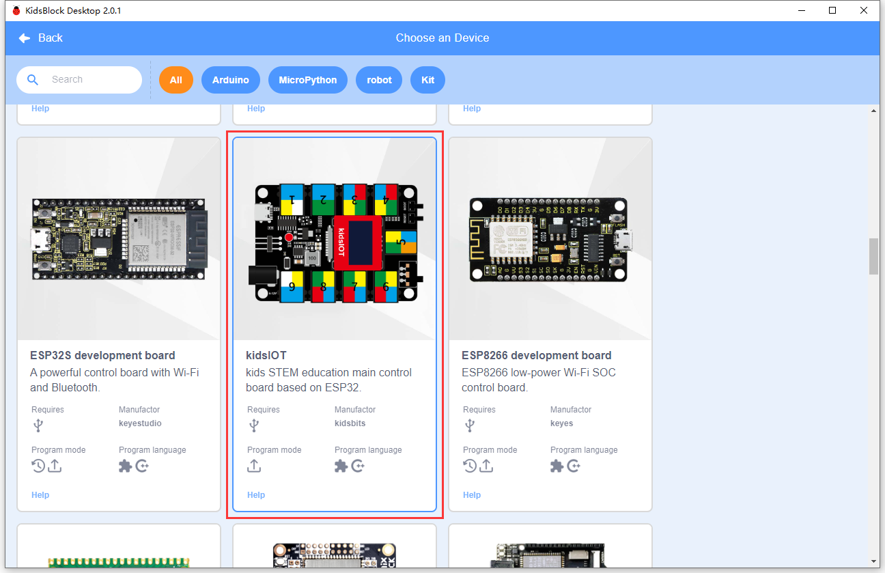

Click **Connect**.

**Go to Editor**.

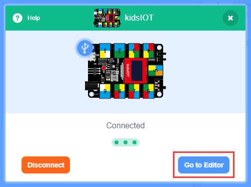

2. Build code blocks and upload.

**Method ①**: Directly drag blocks to the editing area.

After building your blocks, save it to your computer: **File --> Save to your computer**

Click  to upload the code.

**Method ②**: Load code from your computer.

Download code in **1. Code** to your computer. For convenience, here we save it to D:\Code\2.Code_kidsIOT.

**File --> Load from your computer** and choose code to open.

After loading code, connect to the corresponding port.

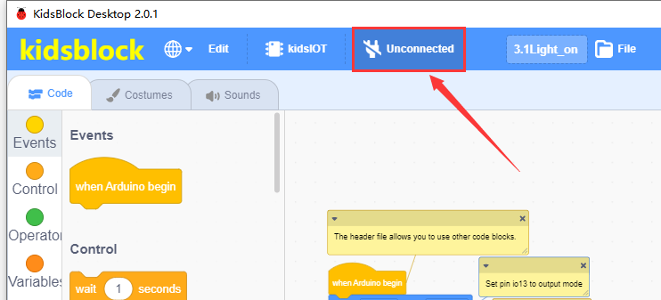

After that, click  to upload code.

**Main Interface**

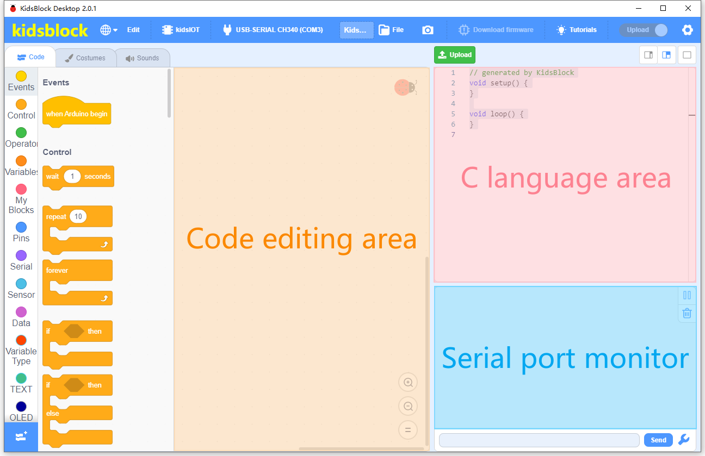

---

## 3. Modules

Please move the codes to a convenient path as your needs, for instance, path: **D:\Code\2.Code_kidsIOT**.

### KidsIOT Ports View

During experiments, modules can only be connected to ports in the same color.

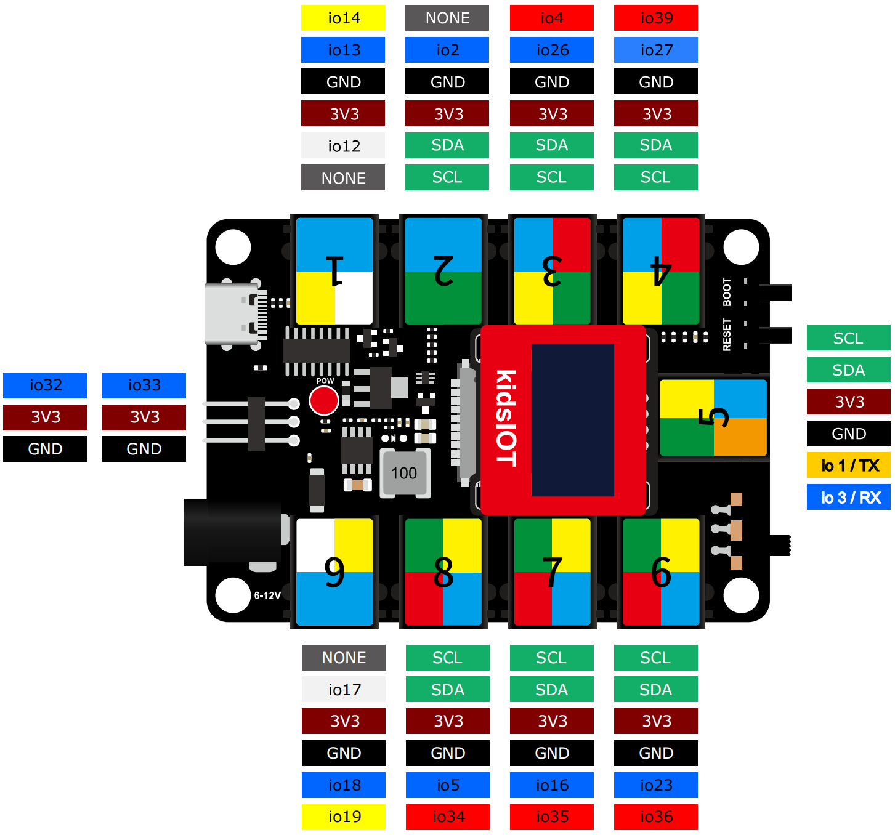

### 3.1 White LED Module

**LED (Light-Emitting Diode)**

LED is a commonly used light emitting device that converts electrical energy into light energy. Usually, it is used as an indicator in circuits and instruments, or as part of texts or numeric display.

It generally includes gallium(Ga), arsenic(As), phosphorus(P), nitrogen(N) and so on. 

|     LED components      | Emitting light colors |
| :---------------------: | :-------------------: |
| gallium arsenide diode  |          red          |
| gallium phosphide diode |         green         |
|  silicon carbide diode  |        yellow         |
|  gallium nitride diode  |         blue          |

#### Parameters

Operating voltage: DC 3.3 ~ 5 V

Operating current: 1.5 mA (Peak: 2.3mA)

Maximum power: 0.07 W

Control signal: digital signal

Dimensions: 48 x 24 x 18 mm (without housing)

Positioning holes: diameter of 4.8 mm

Interface: telephone socket

#### Principle

Modules with blue housing are digital ones, so we should connect to digital io pins of the mainboard (ports with blue).

In this experiment, we connect the white LED module to port 1. According to the board ports view, the digital io pin at port 1 is io13.

When we set the pin to high(1), the LED lights up in white; if we set to low(0), it will be off.

#### Wiring Diagram

#### Test Code

Open KidsBlock and connect the board to your computer. Click **File --> Load from your computer**.

Choose D:\Code\1.Code_kidsuno to open **3.1Light_on.sb3** file.

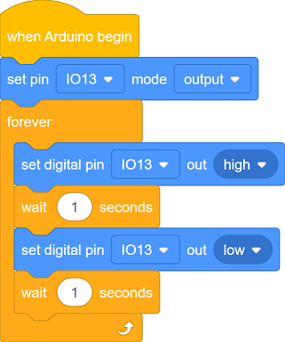

Click to connect to port and then  .

#### Explanations

**Code Blocks**

|            Blocks             |          Code block           |
| :---------------------------: | :---------------------------: |
|    |      |
|              |  |
|              |    |
|  |  |
|  |        |

**Conceive:**

1. **Initialization**

   Set pins and modes.

   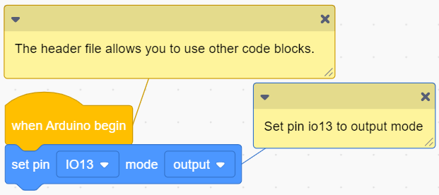

    

   **Build blocks:**

   ① Add  and .

   

    is a header file which is inevitable.

    sets a pin and its mode. pin mode can be one of the followings:

   input

   output
   
   input-pullup

   
   
   ② Set pin to IO13.

   

   ③ set mode to output.
   
   
   
   Q ：Why "output"?
   
   A ：The code is written for the mainboard. For the board, the pin IO13 is outputting power levels (high or low) to the connected module.
   
   

2. **Main Code**

   Loop: LED turns on for 1s and off for 1s.

   

    

   **Build blocks:**

   ① Add .

   

   : Code blocks in it will run in a loop.

   

   ② Put  into "forever". 

   Set pin to IO13, and set to output high.

   

    sets a digital pin and its output power level:

   high

   low

   

   ③ Add a delay  into "forever". 

   

    sets delay times in seconds.

   

   

   Q ：Why delay?

   A ：If you output a high level to LED, it will be always on. Yet, we add a delay of 1s, so it lights up for only 1s. Delay time is the ON/OFF time of LED.

   

   Set pin IO13 to output high for 1s:

   

   ④ Duplicate the blocks.

   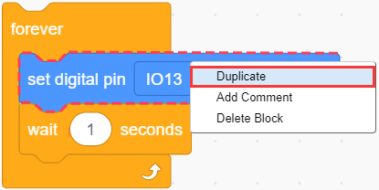

   As follows:

   

   Modify to low. Pin IO13 outputs low for 1s:

   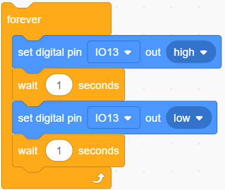

   The LED will circularly be on for 1s and off for 1s.

#### Test Result

After uploading code, the LED module will flash with an interval of 1s (on for 1s and off for 1s).

---

### 3.2 Tilt Sensor

Tilt sensor is also known as one-way ball switch because a ball is contained inside. Its one pin is connected and the other is not. The sensor outputs different level signals depending on whether the sensor is tilted. In applications, it is used for tilt detection and alarm.

#### Parameters

Voltage: DC 3.3 ~ 5V 

Current: 4.2 mA

Maximum power: 0.03 W

Operating temperature: -10°C ~ +50°C

Dimensions: 32 x 24 x 18 mm (without housing)

Positioning holes: diameter of 4.8 mm

Interface: telephone socket

#### Principle

Modules with blue housing are digital ones, so we should connect to digital io pins of the mainboard (ports with blue).

In this experiment, we connect the module to port 2. According to the board ports view, the digital io pin at port 2 is io2.

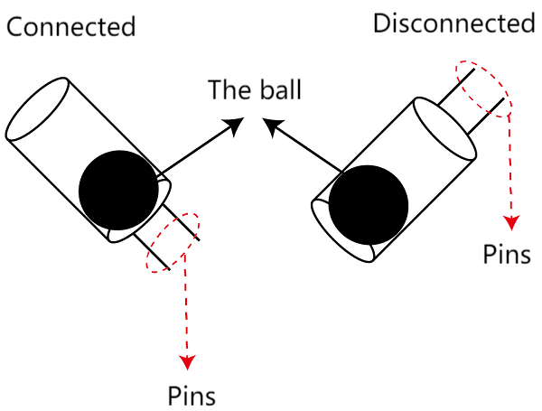

Tilt the sensor and the ball will roll to the pins so that two pins are connected, and the module outputs a low level. If the ball move to the other end, the pins will be disconnected so the module outputs high.

#### Wiring Diagram

#### Test Code

Open KidsBlock and connect the board to your computer. Click **File --> Load from your computer**.

Choose D:\Code\1.Code_kidsuno to open **3.2Tilt.sb3** file.

Click to connect to port and then  .

#### Explanations

**Code Blocks**

|              Blocks               |              Code block               |
| :-------------------------------: | :-----------------------------------: |
|        |              |
|                  |          |
|                  |  |
|        |  |
|        |  |
|  |                      |
|      |          |
|      |      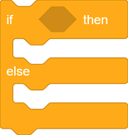      |
|      |                |

**Conceive:**

1. **Initialization**

   Set pins and modes. Initialize the serial port.

   

    

   **Build blocks:**

      ① Add code blocks to the editing area and build as follows:

   

   

       initializes the serial port and sets baud rate (default is 9600). This block is essential when serial port is adopted; or else printing may fail.

   

   Set sensor pin to io2 and mode to input. Initialize serial port to facilitate the message printing on the monitor.

   

   Q ：Why "input"?

   A ：The code is written for the mainboard. For the board, pin io2 is inputting power levels (high or low) from the connected module to the board. According to the power level, the board determines whether the module is tilt.

   

2. **Main Code**

   Loop: Print the power level read by io2, and determine whether it is low(0).

   If yes, the sensor is tilt and the monitor prints *The switch is turned on* ; If not, the sensor is not tilt and *The switch is turned off* will be shown.

   

    

   **Build blocks:**

   ① Add code blocks to the editing area and build as follows:

   

   

    reads power level of a digital pin. It returns 1(high) or 0(low).

    prints the messages on the serial monitor. This message can also be a code block, and the output will be its value. There are three print mode: wrap, no wrap, HEX(hexadecimal).

   

   Set pin to IO2 and print mode to no-wrap.

   

   

   ​     Q : Why "no-wrap"?

      If we set to wrap, the message will have a line break after the power level value being output.

      Wrap: 

      

     No-wrap:

      

    A ：No-wrap is more convenient for us to check the results.

   

   ② Add code blocks to the editing area and build as follows:

   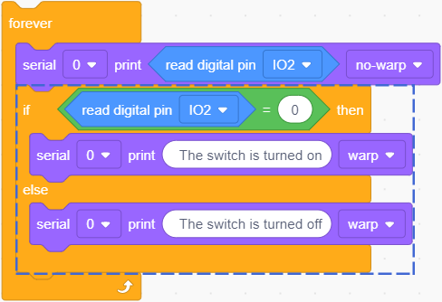

   

    checks whether the two values equal each other. If yes, output True.

    determines the condition is true or false. 

   True: execute codes in "if":

   

   False: execute codes in "else":

   

   

    determines whether the value read by pin io2 equals 0. Put it in "if else" block to set it to the condition.

   value of pin io2 = 0: the condition is true, execute codes in "if", and print two Space + *The switch is turned on* on the serial monitor.

   value of pin io2 ≠ 0: the condition is false, execute codes in "else", and print two Space + *The switch is turned off* on the serial monitor.

   

      Q ：Why Space?

     The value will be too close to the contents, which is not convenient for us to check the outputs.

      Without space:

      

      With space:

      

      A ：We add a space to separate the value and contents.

   

   ③ Add a delay  and set the time to 0.1s.

   

   Q ：Why delay?

   If we do not add a delay, the printing command will always run, so then the serial monitor refreshes the results very fast. A delay of 0.1s will limit the printing speed. Serial monitor refreshes outputs every 0.1s.

   A ：Limit the printing speed.

   

#### Test Result

Set baud rate before uploading code to avoid garbled words.

Click  and set Buadrate to 9600.

After uploading code, tilt the sensor to the pins to connect them, and the red LED will light up, and the monitor prints *The switch is turned on*.

If you tilt it to the other end, the pins will disconnected, so the red LED will go off and *The switch is turned off*  shows on the monitor.

---

### 3.3 PIR Motion Sensor

The human body temperature is generally constant at about 37°, and will emit infrared signals with a wavelength of about 10μm. Passive infrared probes just work by detecting the specific infrared waves emitted by human body.

These 10μm infrared waves are enhanced by the Fresnel filter and concentrated on the infrared sensing source to control the interference of the environment. The infrared sensing sources are usually pyroelectric elements, which can generate an alarm signal when the infrared radiation temperature of the human body changes. Otherwise, no signal will be output.

#### Parameters

Operating voltage: DC 3.3 ~ 5V 

Operating current: 3.6 mA

Maximum power: 0.018 W

View angle: Y = 90°, X = 110° (theoretical value)

Detection distance: ≤5m

Operating temperature: -10°C ~ +50°C

Control signal: digital signal

Dimensions: 48 x 24 x 18 mm (without housing)

Positioning holes: diameter of 4.8 mm

Interface: telephone socket

#### Principle

Modules with blue housing are digital ones, so we should connect to digital io pins of the mainboard (ports with blue).

In this experiment, we connect the module to port 3. According to the board ports view, the digital io pin at port 3 is io26.

When the sensor detects a **human motion** nearby, it outputs high. If no, it outputs low.

#### Wiring Diagram

#### Test Code

Open KidsBlock and connect the board to your computer. Click **File --> Load from your computer**.

Choose D:\Code\1.Code_kidsuno to open **3.3PIR.sb3** file.

Click to connect to port and then  .

#### Explanations

**Code Blocks**

|              Blocks               |              Code block               |
| :-------------------------------: | :-----------------------------------: |
|        |              |
|                  |          |
|                  |  |
|        |  |
|        |  |
|  |                      |
|      |          |
|      |            |
|      |                |

**Conceive:**

1. **Initialization**

   Set pins and modes. Initialize the serial port.

   

2. **Main Code**

   Loop: Print the power level read by io26 and determine whether it is high(1). If yes, the monitor will show  *Some body is in this area!* ; If not, print *No one!* 

   

#### Test Result

Set baud rate before uploading code to avoid garbled words.

Click  and set Buadrate to 9600.

After uploading code, when the PIR motion sensor detects a human motion, it outputs high and the red LED goes off. Monitor prints *Some body is in this area!* ;

If the sensor detects nothing, it outputs low and red LED lights up. Monitor displays *No one!* .

Put you palm above the sensor, and wave it. The sensor will detect the motion and then output high. When you stay still or move your hand away, the sensor detects nothing so then outputs low.

---

### 3.4 8002b Power Amplifier

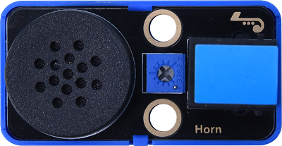

The 8002b power amplifier is mainly composed of an adjustable potentiometer, a speaker and an audio amplifier chip. This module can amplify the output of small audio signals and play them through its low-power speaker. It can also be used as an external amplifier to play music.

#### Parameters

Operating voltage: DC 3.3 ~ 5V 

Operating current: ≤350 mA

Maximum power: 1.5 W

Operating temperature: -10°C ~ +50°C

Input signal: digital signal

Dimensions: 48 x 24 x 18 mm (without housing)

Positioning holes: diameter of 4.8 mm

Interface: telephone socket

#### Principle

Music is an invisible art. It is a language that narrates emotions and thoughts. 

The foundation of music, as we all know, is note. We can compose a variety of melodies and rhythms with different notes. Of all the notes, the most basic are seven:

We can compose a variety of melodies and rhythms with these notes.

This module must be drive by square waves to emit sound. We can change the duty cycle of PWM to control square waves.

- The greater the duty cycle is, the lauder the sound will be.

And the tones vary from different frequency of PWM.

- The higher the frequency is, the higher the tone will be.

**What is PWM?**

PWM (Pulse width modulation) simulates the change of analog signal through digital signal.

Pulse width is the high level in a complete square wave cycle. So, pulse width modulation is to adjust the high level(of course, in other words, low level is also adjusted).

- **PWM frequency**: the number of times the signal going from high level to low level and back to high level in 1 second (one cycle), that is, how many cycles there are in a second.

  **Unit**: Hz

  **Expression**: 50Hz 100Hz

- **PWM cycle**

  $ T= \frac {1}{f}$      $ Cycle= \frac {1}{frequency}$

  If the frequency is 50Hz, the cycle will be 20ms, i.e., there are 50 PWM cycles in one second.

- **PWM duty cycle**: the ratio of high level time to the whole cycle time.

  - Unit: %(1% ~ 100%)
  - Cycle: The time of a pulse signal. The number of cycles in 1s equals the frequency.
  - Pulse width time: high level time.

  
  
  
The relationship between duty cycle and LED brightness

  The longer the high level time is, the greater the duty cycle will be, and the brighter the LED will be.

  **The PWM frequency corresponding to notes**:
  
  

The module boasts a potentiometer that adjusts the volume of sounds. Rotate clockwise to turn the volume up. 

Modules with blue housing are digital ones, so we should connect to digital io pins of the mainboard (ports with blue).

In this experiment, we connect the module to port 4. According to the board ports view, the digital io pin at port 4 is io27.

#### Wiring Diagram

#### Test Code

Open KidsBlock and connect the board to your computer. Click **File --> Load from your computer**.

Choose D:\Code\1.Code_kidsuno to open **3.4Power amplifier.sb3** file.

Click to connect to port and then  .

#### Explanations

**Code Blocks**

|            Blocks             |          Code block           |
| :---------------------------: | :---------------------------: |
|    |      |
|  |    |
|  |  |
|  |        |

**Conceive:**

Add library first. Click  and find **Passive buzzer** to load it.

Back.

Successfully add:

1. **Main Code**

   Loop: Play tone C, D, E, F, G, A, B at the beat of 1/2.

   

    

   **Build blocks:**

   ① Drag code blocks as follows:

   

   

    sets tones and beats of the pin of the amplifier. 

   

      Q ：What is beat? 

      A ：A beat is the basic unit of time in music. You may consider it as the time of a tone being played.

   

   

   Set as follows:

   

   ② Duplicate the blocks.

   

   As follows:

   

   Duplicate 6 times in total:

   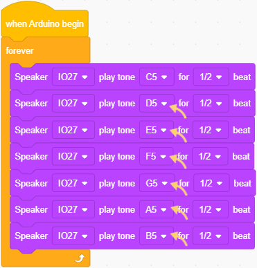

#### Test Result

After uploading code, the amplifier repeatedly plays tone C, D, E, F, G, A, B.

#### Extension

Congratulations! You have played these basic notes successfully! Now let's try to compose a beautiful music and play with this power amplifier!

Twinkle Twinkle Little Star

*Twinkle Twinkle Little Star* is an outstanding musical work in British children's songs, which has been widely circulated around the world for more than two centuries, and has become the most classic children's song in the enlightenment education of all countries and cultures.

In the score,  “-” indicates the duration of the previous note. When building code blocks, we may set longer beats to last the playing of one tone.

According to the score and the music theory, try to write code blocks to play *Twinkle Twinkle Little Star*!

Or you can directly open file **3.4Twinkle Twinkle Little Star.sb3** and upload it to enjoy the song!

---

### 3.5 6812 RGB Module

RGB LED is imaged in the intersection of three primary colors (RGB): red, green and blue. Both white LED and RGB LED are able to emit white light. The former is presented directly in white, while the latter is mixed with red, green and blue.

**Trichromatic Theory**

Human eyes are sensitive to RGB colors. Most colors can be synthesized by RGB in different proportions. Therefore, the vast majority of monochromatic light can also be decomposed into RGB colors. This is the most basic principle of colorimetry --- trichromatic theory.

Red, green and blue lights are called additive primary colors because by the combination of these three primaries in different proportion, various colored lights will produce. Similarly, there are also subtractive ones. So we may add or/and subtract colors as needed. 

The three primary colors of the paint can not compose white, yet, with optical elements, those of light can do it, which is mixed by **three equal parts of R, G, B**.

6812 RGB module is an intelligent external controlled LED light source that integrates control circuit and light emitting circuit. Each LED is a pixel with a total of four pixels, and they can be controlled by only one pin.

#### Parameters

Voltage: DC 3.3 ~ 5V 

Current: 140 mA

Maximum power: 0.7 W

Operating temperature: -10°C ~ +50°C

Dimensions: 48 x 24 x 18 mm (without housing)

Positioning holes: diameter of 4.8 mm

Interface: telephone socket

#### Principle

The 6812 RGB module contains four pixels in series. In fact, no matter how many pixels, we can control any one of the lights to show any color through only one pin.

Modules with blue housing are digital ones, so we should connect to digital io pins of the mainboard (ports with blue).

In this experiment, we connect the module to port 9. According to the board ports view, the digital io pin at port 9 is digital port 18.

#### Wiring Diagram

#### Test Code

Open KidsBlock and connect the board to your computer. Click **File --> Load from your computer**.

Choose D:\Code\1.Code_kidsuno to open **3.5pixel.sb3** file.

Click to connect to port and then  .

#### Explanations

**Code Blocks**

|            Blocks             |                   Code block                    |
| :---------------------------: | :---------------------------------------------: |
|    |                        |
|      |          |
|      |  |
|      |        |
|      |            |
|      |                |
|  |                    |
|  |                          |

**Conceive:**

Add library first. Click  to load **RGB LED Strip**.

1. **Initialization**

   Set pins and modes, and pixel numbers and LED brightness.

   
   
   
   
    sets connected pin and pixel number.
   
    sets the brightness of LED, range: 0 ~ 255.
   
   

2. **Main Code**

   Loop: Respectively light up in red, green, blue, white with each for 1s, and then turn off.

   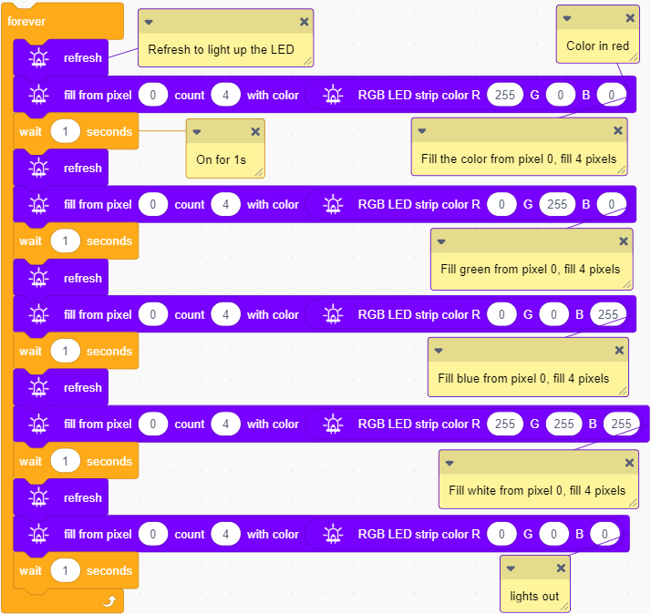

    

   **Build blocks:**

   ① Drag code blocks as follows:

   

   The pixels will light up in red from 0 to the end, each for 1s and 4 pixels in total.

   

    refreshes the colors of pixels. This block is inevitable before changing colors. Otherwise the set color may be not displayed.

   

    sets colors for the pixels.

    : the first number is the beginning pixel.

    : the second number is the number of the pixels.

    : the third box is the color of the pixel. You can choose colors and set its saturation and brightness.

   

    sets the three parameters of RGB. Each value ranges from 0 ~ 255. For example: Red is R=255 and G, B=0; white is R, G, B=0.

   This code block can be combined with the one that sets the colors, which makes it easy to quickly set the color in a stable proportion.
   
   Drag it into the third box of the block:
   
   
   
   As follows:
   
   
   
   Then you can set colors by adjusting the proportion of RGB.
   
   
   
   ② Duplicate the blocks.
   
   
   
   As follows:
   
   
   
   Duplicate three times and modify the proportion as follows:
   
   

#### Test Result

After uploading code, the four pixels repeatedly light up in red, green, white and go off.

---

###  3.6 Thin Film Pressure Sensor

This thin film sensor is an analog input module. The previous modules we learned are all digital ones, so what is the difference between these two types? 

The digital modules can only input/output high or low (3.3V or 0V), while the analog ones can output any voltage value read by ADC analog ports within the range.

The thin film sensor can be regarded as a resistance variable with pressure. When the thin film(circled in red) is pressed, the sensor converts the pressure into resistance and outputs it through the pin(squared in blue).

**Using Method:**

1. Place the pressure sensitive area of the sensor on a firm, flat surface when in use. Using or bending the sensor on a curved or shaped surface will lead to a "responsive" state even without pressure; In this state, the sensor will detect a false pressure value, so the output value is not accurate. 

	If you cannot find an appropriate surface, disassemble the sensor housing.

	First, find the **buckle** of the housing:

Place one of your thumb above the **buckle** and pinch the module with another hand. Pull the buckle in the direction shown below:

At the same time, take the module out of the housing in the following direction:

As follows:

Place the housing upside down and place the thin film on it.

2. After the sensor is stressed and maintained pressure, the output value will drift slightly over time, usually within 5%. Under normal conditions, it is best to lay the film flat without pressure on it.

#### Parameters

Operating voltage: DC 3.3 ~ 5V 

Current: 0.5 mA

Maximum power: 0.0025 W

Range: 0 ~ 5kg

Trigger conduction pressure: 500g

Operating temperature: -10°C ~ +50°C

Dimensions: 48 x 24 x 18 mm

Positioning holes: diameter of 4.8 mm

Interface: telephone socket

#### Principle

The thin film on the sensor detects the pressure value. It converts the detected pressure value into voltage. As the pressure increases, the resistance and the output voltage gradually decreases (3.3V ~ 0). This voltage value is a continuous analog value ranging from 3.3V ~ 0.

The main board is not able to process analog signals directly, so we need to convert them into digital ones. Therefore, ADC(Analog to Digital Converter) is required.

**What is ADC?**

ADC(Analog to Digital Converter) converts analog values to digital ones. The ADC acquisition is integrated in our board, so you can call it directly. 

**kidsIOT ADC Parameters**

1. Reference voltage: 3.3V

2. Resolution: 12bit

   A n-bit ADC means this ADC contains 2ⁿ scales. 

   12-bit ADC contains $2^{12}=4096$ scales, and it outputs totally 4096 digital values (including from 0～ 4095), each scale is $\frac{3.3}{4095}≈0.00081(V)$.

3. General ADC input voltage calculation:

   $ Vin= \frac {AVDD_{ADC}}{2^{Resolution Bit}-1}*ReadData$ 

   $AVDD_{ADC}$: Reference voltage

4. ADC channel: 5 channels

   ADC0 - ADC3 are GPIO26 - 29, among which ADC0, ADC1, ADC2 are available to commonly measure the analog voltage, while ADC3 detects on-board VSYS voltage.

   Since ADC4 is built-in, it cannot be used at the pin. It measures on-board temperature sensor.

Modules with red housing are analog ones, so we should connect to analog ports of the mainboard (ports with red).

In this experiment, we connect the module to port 6. According to the board ports view, the analog io pin at port 6 is io36.

#### Wiring Diagram

#### Test Code

Open KidsBlock and connect the board to your computer. Click **File --> Load from your computer**.

Choose D:\Code\1.Code_kidsuno to open **3.6Pressure.sb3** file.

Click to connect to port and then  .

#### Explanations

**Code Blocks**

|              Blocks               |               Code block                |
| :-------------------------------: | :-------------------------------------: |
|        |                |
|                  |            |
|                  |      |
|        |    |
|        |    |
|            |  |
|            |    |
|            |          |
|  |              |
|  |          |
|      |            |
|      |                  |

**Conceive:**

1. **Initialization**

   Set pins and modes. Initialize the serial port. Define a variable to store the analog value detected by the thin film sensor.

   
   
   
   
    creates a new variable.
   
   - 
   
     define global or local variable.
   
   - 
   
     Choose a variable type.
   
   - 
   
     Name the variable.
   
   - 
   
     Assign an initial value to the variable.
   
   
   
   
   
   Create a float variable named *Pressure_value* to store the analog value read by the sensor with an initial value of 0.

2. **Main Code**

   Loop: print the analog value detected by the sensor and the converted voltage value, and refresh the results every 0.1s.

   

    

   **Build blocks:**

   ① Add code blocks to the editing area and build as follows:

   
   
   
   
    assigns a value to a specific variable.
   
    reads analog values of a pin.
   
   
   
   Connect the sensor to pin IO36. Read the analog value of IO36 and assign it to variable *Pressure_value*, which is used to calculate the actual voltage value. 
   
   ② Add code blocks to the editing area and build as follows:
   
   
   
   
   
    is a variable block.
   
    returns the result of multiplying the values of the left and right values.
   
    returns the value of the left value divided by the right one.
   
   
   
   Code blocks for the calculation of actual voltage: 
   
   
   
   Print analog value and actual voltage value(V) on the serial monitor.
   
   ③ Add a delay  in "forever" and set to 0.1s. It is used to maintain the printing time. 

#### Test Result

Set baud rate before uploading code to avoid garbled words.

Click  and set Buadrate to 9600.

After uploading code, the sensor detects pressure.

Press the thin film by your finger. As the pressure increases, the output voltage gradually decreases.

---

### 3.7 HT16K33_8X8 Dot Matrix

Dot matrix is composed of multiple LEDs, whose collection is called the "matrix", where a single unit is called the "dot". The 8X8 dot matrix consists of a total of 64 LEDs, and each one is placed at the intersection of rows and columns.

#### Parameters

Operating voltage: DC 3.3 ~ 5V 

Current: 190 mA

Maximum power: 0.95 W

Operating temperature: -10°C ~ +50°C

Dimensions: 48 x 24 x 18 mm

Positioning holes: diameter of 4.8 mm

Interface: telephone socket

#### Principle

We control the white LED module by an IO port, so an 8x8 dot matrix requires a total of 16 ports, which is a very waste of ports. To this end, we specially designed this module, LEDs on which can be controlled by one I2C communication interface.

Here is the coordinate diagram of 8x8 dot matrix, and a certain LED is represented by (X,Y).

Modules with green housing are I2C ones, so we should connect to ports with green.

In this experiment, we connect to port 5.

#### Wiring Diagram

#### Test Code

Choose D:\Code\1.Code_kidsuno to open **3.7Dot matrix.sb3** file.

Click to connect to port and then  .

#### Explanations

**Code Blocks**

|            Blocks             |                 Code block                  |
| :---------------------------: | :-----------------------------------------: |
|    |                    |
|    |        |
|    |      |
|    |            |
|    |  |
|    |        |
|    |      |
|  |                |
|  |                      |

**Conceive:**

Add library first. Click  to load **Matrix 8*8 IIC**.

1. **Initialization**

   Initialize the dot matrix.

   

2. **Main Code**

   Loop: Light up dot (6,6) for 1s; Draw a line from dot (6,2) to (6,6) to light up for 1s; Light up a smile icon for 1s.

   

    

   **Build blocks:**

   ① Drag code blocks as follows:

   

   Light up dot (6,6) for 1s.

   

    clears the dot matrix, so all LED on it will go off. Each time before the dot matrix is operated, it should be cleared to avoid the LED that has been lit affecting the currently operated ones.

     lights up a single LED. You only need to set the coordinate (x,y). For its state, HIGH is "light on", and LOW is "light out".

    refreshes the dot matrix. After operating on this module, remember to refresh it.

   

   ② Drag code blocks as follows:

   

   Draw a line from dot (6,2) to (6,6) to light up for 1s.

    draws a line by inputting the coordinates of the starting and ending point. 

   

   ③ Drag code blocks as follows:

   

   Light up a smile icon for 1s.

   

    draws icons on the dot matrix.

   

   Hold down the mouse, slide on the dot matrix to light the corresponding LED. Same operations can also turn off the LED that has been lit.

   Note that the pattern drawn here will reverse 180° when displayed on the module.

   

#### Test Result

After uploading code, the dot matrix will show the set icons.

---

### 3.8 RFID Module

RFID(Radio Frequency Identification) is a kind of communication that identifies specific targets through radio signals to read and write relevant data, without establishing mechanical or optical contact between the identification system and the specific target.

In application, RFID is widely used in clothing tags, library book searching systems, access control systems and food safety traceability systems.

#### Parameters

Operating voltage: DC 3.3 ~ 5V 

Operating current: 60 mA

Operating power: 0.3 W

Sensing range: 0 ~ 15 mm

Operating temperature: -10°C ~ +50°C

Dimensions: 48 x 24 x 18 mm (without housing)

Positioning holes: diameter of 4.8 mm

Interface: telephone socket

#### Principle

RFID adopts radio frequency to carry out non-contact two-way data transmission between the reader and the radio frequency card for target identification and data exchange. 

The working principle of RFID module:

Sending signals: An RFID module (reader) sends a radio signal, usually an RF signal within a specific frequency range.

Reception response: When the IC card (RF card) enters the sensing range of the RFID module, the card receives signals from the reader and is activated by the energy obtained from them. After activation, the card's chip converts the stored information into a response signal that is sent back to the reader via the antenna.

Data processing: After the RFID module receives the signal sent by the IC card, it analyzes and processes these signals through the RF communication protocol. The board then receives these data and store, analyze, process, or pass it on to other systems.

Modules with green housing are I2C ones, so we should connect to ports with green. In this experiment, we connect to port 7.

#### Wiring Diagram

#### Test Code

Open KidsBlock and connect the board to your computer. Click **File --> Load from your computer**.

Choose D:\Code\1.Code_kidsuno to open **3.8RFID.sb3** file.

Click to connect to port and then  .

#### Explanations

**Code Blocks**

|            Blocks             |              Code block               |
| :---------------------------: | :-----------------------------------: |
|    |              |
|        |      |
|        |      |
|    |  |
|    |  |
|  |          |

**Conceive:**

Add library first. Click  to load **RFID RC522 IIC**.

1. **Initialization**

   Initialize RFID module and the serial port. 

   

   

    initializes the RFID module, which is required when operating on RFID.

   

2. **Main Code**

   Loop: 

   ① Keep sending signals to search new IC card(s).

   ② Receive IC card response and return the data.

   ③ Print the read details of the IC card.

   

   

    reads the IC card data. When an IC card response is received, this code block reads the  IC card data.

   

#### Test Result

Set baud rate before uploading code to avoid garbled words.

Click  and set Buadrate to 9600.

Before uploading code, please wire up accordingly to ensure that the serial monitor works normally. 

After uploading code, place the white IC card at the sensing range of the RFID module.

The serial monitor will print the read information of the IC card.

**NOTE: IC card data vary from cards. Please record your IC card information, which will be used in later experiment.**

---

### 3.9 AK8975 Three-axis Magnetic Sensor

The three-axis magnetic sensor is used to measure and detect the magnetic field force. It detects geomagnetic field on three axes.

**Geomagnetic Field**

Geomagnetic field refers to the natural magnetic field that exists inside the Earth. The Earth can be regarded as a magnetic dipole, with one pole near the geographical North Pole and the other near the geographical South Pole. The force of this magnetic field is about 0.5 to 0.6 Gauss.

**Geomagnetic Sensor**

The geomagnetic field is a vector that, for a fixed location, can be divided into two components parallel to the local horizontal plane and one component perpendicular to the local horizontal plane. If the electronic compass is kept parallel to the horizontal plane, the three axes of the compass correspond to these three components.

For the two parallel components, their vector sum always points to magnetic north. **Course Angle (Azimuth)** in the compass is the Angle between the current direction and magnetic north. Since the compass remains horizontal, it is possible to calculate **Course Angle** through the values of the two axes(usually X and Y). When the compass rotates horizontally, **the Course Angle varies between 0° and 360° **.

To sum up, three-axis magnetic sensor is widely applied to navigation and positioning systems, attitude control and motion detection, environmental monitoring and safety applications, as well as medical devices. With continuous progress and innovation, its applications will expand, bringing more convenience and possibilities to all walks of life.

#### Parameters

Operating voltage: DC 3.3 ~ 5V 

Operating current: 20 mA (at self-check mode)

Maximum power: 0.1 W

Operating voltage: -10°C ~ +50°C

Dimensions: 48 x 24 x 18 mm (without housing)

Positioning holes: diameter of 4.8 mm

Interface: telephone socket

#### Principle

The three-axis magnetic sensor adopts IIC communication protocol. When using, we should connect to ports with green. In this experiment, we connect to port 8.

#### Wiring Diagram

#### Test Code

Open KidsBlock and connect the board to your computer. Click **File --> Load from your computer**.

Choose D:\Code\1.Code_kidsuno to open **3.9Three-axis magnetic sensor.sb3** file.

Click to connect to port and then  .

#### Explanations

**Code Blocks**

|            Blocks             |              Code block               |
| :---------------------------: | :-----------------------------------: |
|    |              |
|            |          |
|            |    |
|            |        |
|    |  |
|    |  |
|  |          |
|  |                |

**Conceive:**

Add library first. Click  to load **ak8975**.

1. **Initialization**

   Initialize AK8975 three-axis magnetic sensor and the serial port.

   

   

    initialize the AK8975 three-axis magnetic sensor.

   

2. **Main Code**

   Loop: 

   Print geomagnetic data for three axes, and wrap to print the value of Course Angle. Refresh the results per second.

   

   

    reads the values on axis X, Y, Z; click the triangle to choose an axis.

    reads the value of Course Angle.
   
   

#### Test Result

Set baud rate before uploading code to avoid garbled words.

Click and set Buadrate to 9600.

Before uploading code, please wire up accordingly to ensure that the serial monitor works normally. 

After uploading code, the serial monitor prints the values of axis X, Y, Z and the value of Course Angle.

Rotate the sensor horizontally, the Course Angle degree value will change in the range of 0° ~ 360°.

---

### 3.10 Servo

There are many specifications of servos, yet all contains three wires: brown(GND), red(power positive) and orange(signal). Colors may vary from servo brands.

#### Parameters

Operating voltage: DC 3.3 ~ 5V

Rated voltage: 4.8V

Rated current: 200 mA

Angular speed: 60°/0.12s

Operating temperature: -10°C ~ +50°C

Length: 5 LEGO holes 8x5 = 40 mm

Width: 2 LEGO holes 8x2 = 16 mm

Height: 3 LEGO height units 3.2x3 = 9.6 mm

Basic hole size: diameter of 4.8

Interface: 3pin interface spacing 2.54 mm

#### Principle

Servo is usually controlled by PWM(pulse width modulation). This 270° servo is compatible with LEGO, whose angle ranges from -45°  ~ 225°.

NOTE: 270° servo rotates within -45° ~ 225°, which is 270° in total, rather than rotating to 270°.

Before operating on 270° servo, please import library first.

#### Wiring Diagram

We connect the 270° servo to the pin io33 of the main board via 3pin wire spacing 2.54 mm.

#### Test Code

Open KidsBlock and connect the board to your computer. Click **File --> Load from your computer**.

Choose D:\Code\1.Code_kidsuno to open **3.10Servo.sb3** file.

Click to connect to port and then  .

#### Explanations

**Code Blocks**

|             Blocks              |            Code block             |
| :-----------------------------: | :-------------------------------: |
|      |          |
|  |  |
|    |      |
|    |            |

**Conceive:**

Add library first. Click  to load **ESP32 Servo 270**.

1. **Main Code**

   Loop: Servo rotates to -45°, 45°, 135°, 225° accordingly with an interval of 1s between every two.

   NOTE: 270° servo rotates within -45° ~ 225°, which is 270° in total, rather than rotating to 270°.
   
   
   
    
   
   **Build blocks:**
   
   ① Add code blocks to the editing area and build as follows:
   
   
   
   
   
    sets the pin and the rotating degree of the servo.
   
   
   
   Connect the servo to IO33 and rotate it to -45°, pause 1s.
   
   ② Duplicate the blocks.
   
   
   
   As follows:
   
   
   
   Duplicate another more twice and modify as follows:
   
   

#### Test Result

After uploading code, servo rotates to -45°, 45°, 135°, 225° accordingly with a pause of 1s after each rotation. And then it back to -45° to repeat these actions.

---

## 4. Comprehensive Experiment

### 4.1 Card-scanning Door-lock Control Device

It is an ideal for smart safe house that the Card-scanning Door-lock Control Device features both security and convenience.

In this experiment, we adopt RFID module and a servo to form a door-lock control device, and the RFID module works in real time. When the correct IC card is identified, the door opens; Otherwise, the door won't open.

#### Flow

#### Assembly

**Required Parts**

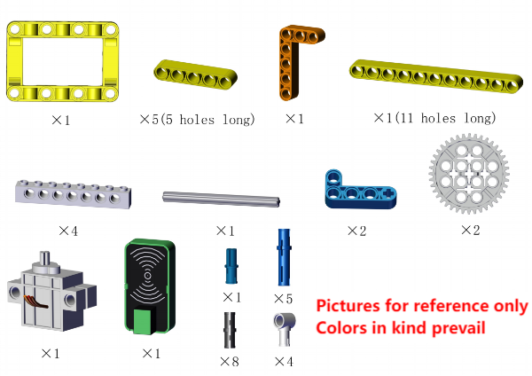

**Step 1**

**Step 2**

**Step 3**

**Step 4**

**Step 5**

**Step 6**

**Step 7**

**Step 8**

**Step 9**

**Step 10**

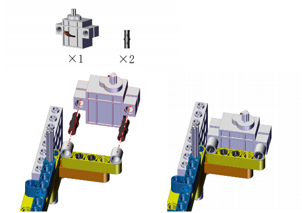

Calibration is required after the servo is mounted. Connect the servo to io33 on the board and connect the board to computer via USB cable.

Open KidsBlock, click File --> Load from your computer.

Choose D:\Code\2.Code_kidsIOT to open **Servo_Calibration.sb3** file.

Click to connect to port and then  .

After calibration, disconnect the board to the computer and continue the assembly.

**Step 11**

**Step 12**

Note that the two gears mesh in order to drive smoothly.

**Step 13**

**Step 14**

**Completed**

#### Wiring Diagram

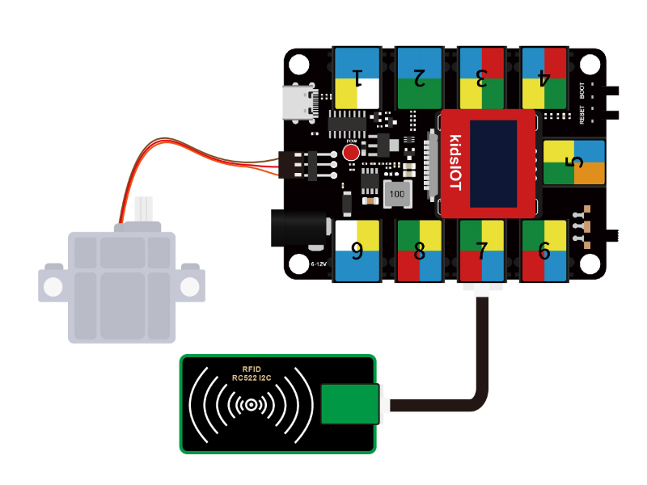

#### Test Code

Open KidsBlock and connect the board to your computer. Click **File --> Load from your computer**.

Choose D:\Code\2.Code_kidsIOT to open **4.1Card-scanning access control machine.sb3** file.

Click to connect to port and then  .

#### Explanations

**Conceive:**	

First, set the rotation angles for opening and closing the door. Herein, we set angle to 120° to open the door, and 0° to close the door.

Then, when the RFID module receives a correct IC card code, it drives the servo to open the door for 3s. Otherwise, servo stays still.

**Build blocks:**

1. Initialization.

   

2. Loop.

   Determine whether the IC card code is correct. If yes, servo opens the door. If not, close the door.
   
   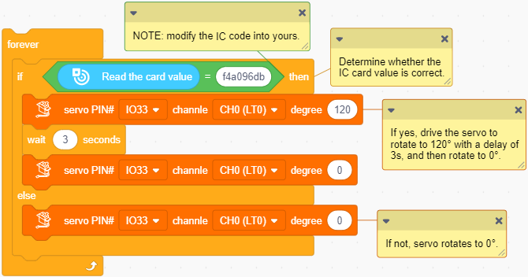

#### Test Result

After uploading code, scan the correct IC card, and the door will open for 3s and then close.

---

### 4.2 Invasion Alarm

Invasion alarm is a device that alarms when detecting illegal invasion in a prevention area. It plays a pivotal role in security prevention, so it is widely applied to family, stores, warehouses and supermarkets. Thus, our life can be better protected from illegal invasion. Meanwhile, our personal and property safety can also be guaranteed.

In this experiment, we adopt PIR motion sensor, power amplifier and a white LED to form an invasion alarm. When someone is detected, the white LED flashes and the amplifier alarms.

#### Flow

#### Assembly

**Required Parts**

**Step 1**

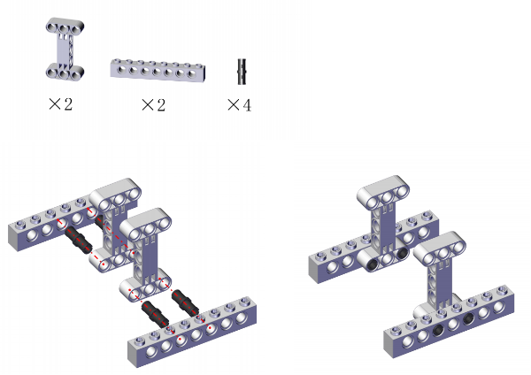

**Step 2**

**Step 3**

**Step 4**

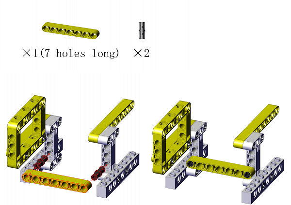

**Step 5**

**Step 6**

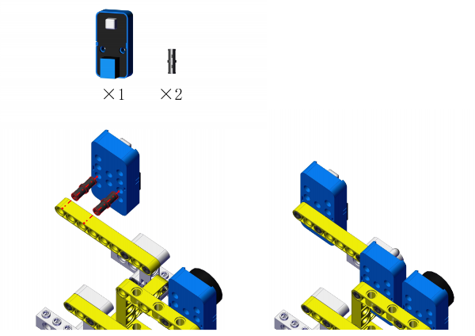

**Step 7**

**Completed**

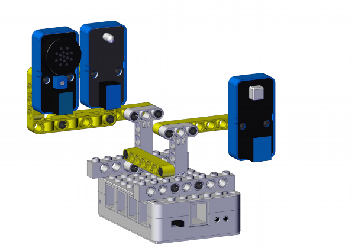

#### Wiring Diagram

#### Test Code

Open KidsBlock and connect the board to your computer. Click **File --> Load from your computer**.

Choose D:\Code\2.Code_kidsIOT to open **4.2Invasion alarm.sb3** file.

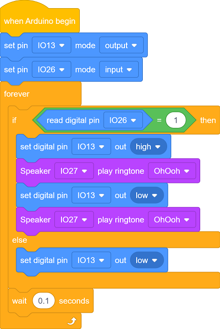

Click to connect to port and then  .

#### Explanations

**Conceive:**

When the sensor detects a human motion (an invasion), the LED flashes and the amplifier alarms. If it detects nothing, LED will go off and the amplifier will not emit sound.

**Build blocks:**

1. Initialization: Set the pins of the PIR motion sensor, white LED module and the power amplifier.

   

2. Loop.

   Read the power level of the board input from the PIR motion sensor.

   Determine whether the power level is 1(indicates an invasion).

   - If yes, the LED flashes and the amplifier alarms.
   - If not, LED will go off and the amplifier will not emit sound.
   
   

#### Test Result

After uploading code, when the sensor detects a human motion (an invasion), the LED flashes and the amplifier alarms.

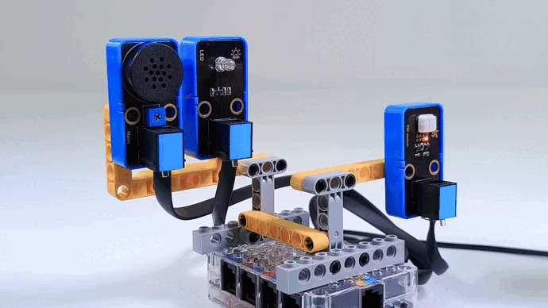

---

### 4.3 Track Alarm

Track alarm ensures security by detecting pressure. It will remind host when detecting tracks to ensure the safety and property.

In this experiment, we adopt a 8x8 dot matrix and a thin film pressure sensor to form a track alarm. When someone is detected stepping on the sensing area, the dot matrix displays a footprint pattern as a reminder.

#### Flow

#### Assembly

**Required Parts**

Place the pressure sensitive area of the sensor on a firm, flat surface when in use. For details, please refer to Chapter 3.6.

**Step 1**

**Step 2**

**Step 3**

**Step 4**

**Step 5**

**Step 6**

**Step 7**

**Step 8**

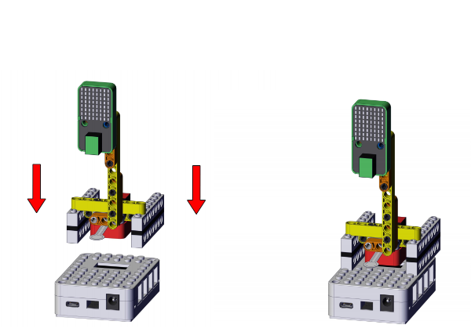

**Step 9**

**Completed**

#### Wiring Diagram

#### Test Code

Open KidsBlock and connect the board to your computer. Click **File --> Load from your computer**.

Choose D:\Code\2.Code_kidsIOT to open **4.3Track alarm.sb3** file.

Click to connect to port and then  .

#### Explanations

**Conceive:**

When someone steps on the pressure sensing area of the sensor, the output analog value of the sensor will decrease. 

Set a threshold first to determine whether there is pressure. When the output value is smaller than the threshold, someone steps on this area; If the value is greater than the threshold, no track is detected.

If pressure is detected, a footprint icon will be displayed on the dot matrix. 

**Build blocks:**

1. Initialization: initialize the dot matrix and set the pin of the thin film pressure sensor.

   

2. Loop.

   Determine whether the output analog value is smaller than 600 (if yes, tracks are detected).

   - analog value < 600: the dot matrix shows a footprint icon as a reminder.
   - analog value ≥ 600: the dot matrix displays nothing.

   

#### Test Result

After uploading code, press the thin film with your finger, and you will see the dot matrix shows a footprint.

---

### 4.4 Motion Alarm

Motion alarm has become an important anti-theft device to protect the items in the smart safe house.

In this experiment, we adopts a three-axis magnetic sensor, a power amplifier and a 6812 RGB module to form a motion alarm. When a certain item moves to a specific angle, the alarm will be triggered: the amplifier sounds and the 6812 RGB emits lights.

#### Flow

#### Assembly

**Required Parts**

**Step 1**

**Step 2**

**Step 3**

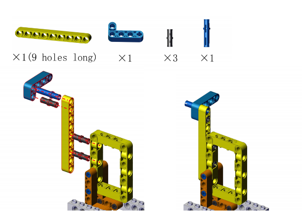

**Step 4**

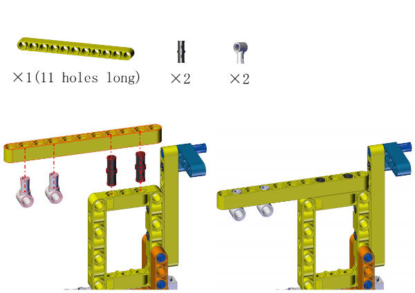

**Step 5**

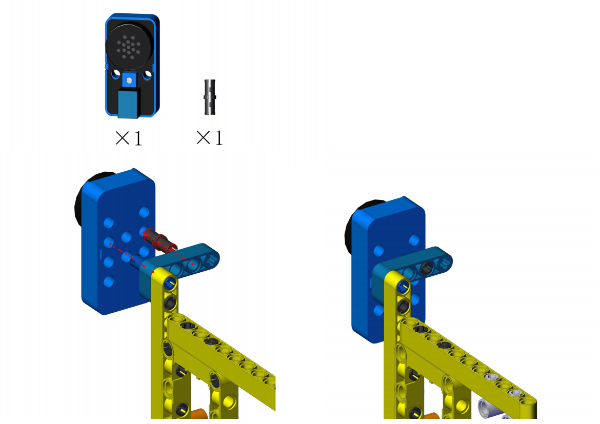

**Step 6**

**Step 7**

**Completed**

#### Wiring Diagram

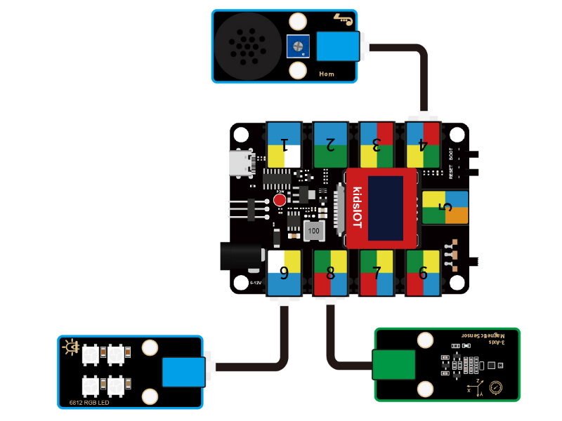

#### Test Code

Open KidsBlock and connect the board to your computer. Click **File --> Load from your computer**.

Choose D:\Code\2.Code_kidsIOT to open **4.4Motion Alarm.sb3** file.

Click to connect to port and then  .

#### Explanations

**Conceive:**

Set a threshold angle range to determine whether objects have been moved.

Place the object and ensure its Course Angle is within the range, which means the object is not moved. Once the Course Angle value is greater than the threshold, it indicates that the item has been moved, so the amplifier alarms and the 6812 RGB lights up.

**Conceive:**

1. **Initialization**

   Initialization: initialize AK8975 three-axis magnetic sensor; set the pin and the pixel number of the 6812 RGB module and set the brightness to 5; initialize serial port; define a float variable *angle* to store the read Course Angle.

   

2. **Main Code**

   Assign the calculated Course Angle to the variable *angle* and print it on the serial monitor.

   Determine whether the angle is within 0° ~ 45°(this range can be modified according to needs).

   - 0° < angle < 45°: the amplifier stay quiet and LED keeps off.
   - angle is not within 0° ~ 45°: the object is moved, so the amplifier alarms and the LED lights up in yellow. 

   

    

   **Build blocks:**

   ① Add code blocks to the editing area and build as follows:

   

   Read the Course Angle of the AK8975 three-axis magnetic sensor and assign it to variable *angle*.

   ② Add code blocks to the editing area and build as follows:

   

   

    determines whether the left value is greater than the right one. If yes, output True.

    determines whether the left value is smaller than the right one. If yes, output True. 

    determines whether the two conditions are both satisfied. If yes, output True.

   

   if else block determines whether the object is moved.

   Conditions:  sets the range to 0 ~ 45. When the object is moved, the angle exceeds this range.
   
   So this block determines whether the variable *angle* is within 0 ~ 45.
   
   - If yes, execute codes in if to turn off all pixels.
   - If not, execute codes in else to light up all pixels in yellow, and the amplifier alarms.

#### Test Result

After uploading code, place the device and maintain the Course Angle within 0° ~ 45°. In the initial state, the amplifier does not emit sound and the pixels are off. Move this device, and the angle will exceed the range of 0° ~ 45°, so the amplifier alarms and the pixels are on in yellow.

---
