# Smart Safe House for kidspico

## 1. Code and Firmware

[DOWNLOAD](../Code.zip)

Download and unzip these files. Here all codes are in folder **3.Code_kidspico** and firmware is at  **3.Firmware_kidspico**.

For convenience, <span style="color: rgb(2550, 10, 50);">we move the codes into: **D:\Code\3.Code_kidspico**.</span> You can also choose to move it into any disks at will. 

---

## 2. Development Environment Configuration

### 2.1 Thonny Download

#### Windows

**We demonstrate on Windows 10.**

Download: [Thonny Official](https://thonny.org)

Click **Windows** to choose one version to download.


#### MAC

Similar to Windows.


### 2.2 Thonny Installation

Two methods:

- Install Thonny+Python package

	Recommended for beginners: When you install, the Python environment and Thonny will be packaged so both installed. There are also two ways to install the package:

	- Installer

		

	- Portable variant

		

- Install Thonny only

  Recommended for developers: When the user already has a python environment, `pip install thonny` comes in handy to install Thonny separately.

  

Please just install according to your needs.

#### Installer

Here we demonstrate how to install `Installer with 64-bit Python 3.10` on <span style="background:#ff0;color:#000">64bit Windows 10</span>.

(1）After downloading, click  . And you will see **Select Setup Install Mode**, choose **Install for me only**.


（2）**Next** 


（3）Tick **I accept the agreement** and **Next**.


（4）The default path is Disk C, or you can click **Browse...** to modify the path. After that, click **Next**.


（5）Choose a path to create the program's shortcuts, and click **Next**.


（6）Tick **Create desktop icon** and click **Next**.

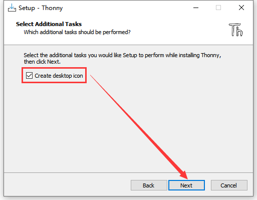

（7）Inatall


（8）“**Finish**”


（9）Open Thonny and choose your language.


（10）Main interface:


#### Portable Variant

Here we demonstrate how to install `Portable variant with 64-bit Python 3.10` on <span style="background:#ff0;color:#000">64bit Windows 10</span>.

(1）After downloading and being unzipped, click  to choose your language.


（2）Main interface:


（3）For convenience, please send  to Desktop(create shortcut).


Shortcut: 

---

### 2.3 Firmware

Press and hold the BOOT button on the kidspico mainboard, connect it to PC via USB cable and then release the BOOT button. 

A removable hard disk will show up.

Open folder **3.Firmware_kidspico**, find and copy the firmware  into this disk.


After that, open Thonny to connect to port (COM number varies from devices). 


---

### 2.4 Thonny

#### Interface

Click **View** and tick **Files** to open the file path management.


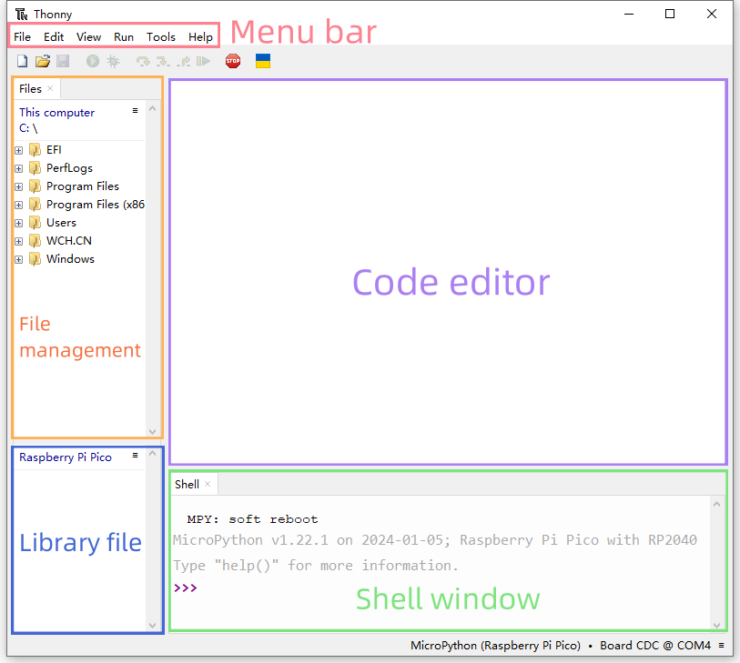

#### Toolbar


|          ICON           |            FUNCTION            |
| :---------------------: | :----------------------------: |
|  |          New (Ctrl+N)          |
|  |        Open... (Ctrl+O)        |
|  |         Save (Ctrl+S)          |
|  |    Run current script (F5)     |
|  |      Debug current script      |
|  |         Step over (F6)         |
|  |         Step into (F7)         |
|  |            Step out            |
|  |          Resume (F8)           |
|  | Stop/Restart backend (Ctrl+F2) |

---

### 2.5 Test

<span style="color: rgb(2550, 10, 50);">Please download and unzip code files and save them in a path as your need. For instance, **D:\Code\3.Code_kidspico**.</span>

In Files, click **This computer**.


Enter **Disk D** and open folder **Code**, find **3.Code_kidspico** and you will see all codes.

  

Connect to kidspico to the computer via USB cable and choose COM port. 


#### Test Shell Command

Input the following code in Shell.

```python
print('hello world')
```


Press "Enter" and the Shell prints **hello world**.


---

#### Test Online Running

Click to open code **Onboard_LED.py**.


Click  to run the code, and the yellow LED on kidspico board will flashes: on for 1s and off for 1s.


Click  or press Ctrl+C to exit online running.

---

#### Test Offline Running

**Method ①**: Offline run an already written program

Ensure the software is not "online". Click  or press Ctrl+C to exit online running.

Open **Onboard_LED.py** in Files: File --> Save as... 


Choose Raspberry Pi Pico.


We name it as **main.py** (The name must be main.py, otherwise the code will fail to execute).


Unplug the USB cable connecting kidspico and computer. 

The main.py code will automatically execute as long as the kidspico board is powered on. You will see the yellow LED flashes per second. 


**Method ②**: Offline run a new program.

Connect the kidspico to the computer via USB cable.


Click  to create a new script and paste the code of Onboard_LED.py on it.


Click  to save in Raspberry Pi Pico.


We name it as **main.py** (The name must be main.py, otherwise the code will fail to execute).


The main.py code will automatically execute as long as the kidspico board is powered on. You will see the yellow LED flashes per second. 


---

## 3. Modules

<span style="color: rgb(2550, 10, 50);">Please move the codes to a convenient path as your needs, for instance, path: **D:\Code\3.Code_kidspico**.</span>

### Kidspico Ports View

During experiments, <span style="color: rgb(2550, 10, 50);">modules can only be connected to ports in the same color.</span>


### 3.1 White LED Module


**LED (Light-Emitting Diode)**

LED is a commonly used light emitting device that converts electrical energy into light energy. Usually, it is used as an indicator in circuits and instruments, or as part of texts or numeric display.

It generally includes gallium(Ga), arsenic(As), phosphorus(P), nitrogen(N) and so on. 

|     LED components      | Emitting light colors |
| :---------------------: | :-------------------: |
| gallium arsenide diode  |          red          |
| gallium phosphide diode |         green         |
|  silicon carbide diode  |        yellow         |
|  gallium nitride diode  |         blue          |


#### Parameters


Operating voltage: DC 3.3 ~ 5 V

Operating current: 1.5 mA (Peak: 2.3mA)

Maximum power: 0.07 W

Control signal: digital signal

Dimensions: 24 x 48 x 18 mm (without housing)

Positioning holes: diameter of 4.8 mm

Interface: telephone socket


#### Principle


Modules with blue housing are digital ones, so we should connect to digital io pins of the mainboard (ports with blue).


In this experiment, we connect the white LED module to port 1. According to the board ports view, the digital io pin at port 1 is io11.

When we set the pin to high(1), the LED lights up in white; if we set to low(0), it will be off.


#### Wiring Diagram


#### Test Code

Open Thonny and connect to COM port. Open **3.1Light_on.py** in **Files** and click .

```python
'''
 * Filename    : Light_on
 * Thonny      : Thonny 4.1.4
 * Auther      : http//www.keyestudio.com
'''
from machine import Pin
import time

led = Pin(11, Pin.OUT)  # Set an led object and connect it to pin 11, set pin to output
while True:
    led.on()       # led on
    time.sleep(1)  # delay 1s
    led.off()      # led off
    time.sleep(1)  # delay 1s
```

#### Explanations


1. `from machine import Pin`

   Import Pin from machine to enable its functions.
   
   
   
   **machine.Pin**
   
   ```python
   machine.Pin(id,mode,pull,value)
   ```
   
   **id** ：GPIO number, within 0-29. For example, if you enable GPIO11, fill in with 11.
   
   **mode** ：pin mode can be one of the followings:
   
   ​	Pin.IN(0) - set pin to input
   
   ​	Pin.OUT(1) - set pin to (normal)output
   
   ​	Pin.OPEN_DRAIN(2) - set pin to open drain output
   
   **pull** ：specifies whether the pin is connected to a (weak-)pull resistor; it is valid only at input mode, and can be one of the followings:
   
   ​	None - no pull-up/down
   
   ​	Pin.PULL_UP(1) - enable pull-up resistor
   
   ​	Pin.PULL_DOWN(2) - enable pull-down resistor
   
   **value** ：only work at Pin.OUT and Pin.OPEN_DRAIN mode; assign the initial output pin value. Or else, the peripheral state of the pin stays still. 0 is low(off) while 1 is high(on).
   
   Pin.on() - set pin to high
   
   Pin.off() - set pin to low


2. `import time`

   Import **time** type so that its related functions can be adopted.


3. `led = Pin(11, Pin.OUT)`

Set LED pin io11 to output mode.


Q ：Why "output"?

A ：The code is written for the mainboard. For the board, pin io11 is outputting power levels (high or low) to the connected module.


4. `while True:`

   Statements in this function will execute in a loop.

   Formula of while loop function:

```python
while (condition)：
    (statements)……
```


5. `led.on()` 和 `led.off()`

   At pin io11 on the mainboard, respectively output high(1) and low(0); i.e., output high(1)/low(0) to LED module to make it on/off.


6. `time.sleep(1)` 

   Delay 1s.

   

   Q ：Why delay?

   A ：If you output a high level to LED, it will be always on. Yet, we add a delay of 1s, so it lights up for only 1s. Delay time is the ON/OFF time of LED.
   
   


#### Test Result


After uploading code, the LED module will flash with an interval of 1s (on for 1s and off for 1s).


Click  or Ctrl+C to exit the execution.


---

### 3.2 Tilt Sensor


Tilt sensor is also known as one-way ball switch because a ball is contained inside. Its one pin is connected and the other is not. The sensor outputs different level signals depending on whether the sensor is tilted. In applications, it is used for tilt detection and alarm.


#### Parameters


Voltage: DC 3.3 ~ 5V 

Current: 4.2 mA

Maximum power: 0.03 W

Operating temperature: -10°C ~ +50°C

Dimensions: 32 x 24 x 18 mm (without housing)

Positioning holes: diameter of 4.8 mm

Interface: telephone socket


#### Principle


Modules with blue housing are digital ones, so we should connect to digital io pins of the mainboard (ports with blue).


In this experiment, we connect the module to port 2. According to the board ports view, the digital io pin at port 2 is io8.


Tilt the sensor and the ball will roll to the pins so that two pins are connected, and the module outputs a low level. If the ball move to the other end, the pins will be disconnected so the module outputs high.


#### Wiring Diagram


#### Test Code

Open **3.2Tilt.py** in **Files** and click .

```python
'''
 * Filename    : Tilt
 * Thonny      : Thonny 4.1.4
 * Auther      : http//www.keyestudio.com
'''
from machine import Pin
import time

tilt = Pin(8, Pin.IN)

while True:
    tile_value = tilt.value()
    print(tile_value, end = " ")
    if  tile_value== 0:
        print("The switch is turned on")
    else:
        print("The switch is turned off")
    time.sleep(0.1)
```

#### Explanations


1. `tilt = Pin(8, Pin.IN)`

   Set sensor pin to io8 and mode to input. For the main board, Pin io8 is inputting power levels to the board from the tilt sensor.


2. `tile_value = tilt.value()` 
   
   Assign the power level output by the sensor to the variable  `tile_value` .


3. `print(tile_value, end=' ')` 
   
   Print  `tile_value`  ending with a Space without wrapping.
   
   
   
   `print()`  is a command that wrap to print messages by default. The **line break** `end ='\n'` at the end of `print()` is usually omitted. 
   
   We replace  `\n`  with `end=''`  so the line break will become a Space. This operation will disable the default line break.
   
   `end=' '` ：Add a Space at the end rather than wrapping.
   
   
   
   Q ：Why end with space  `end=''` ?
   
   The value of  `tile_value`  will be very close to the statement if no space, which is not convenient for us to check the outputs.
   
   Without Space (`end=''`):
   
   
   
   With Space (`end=' '`):
   
   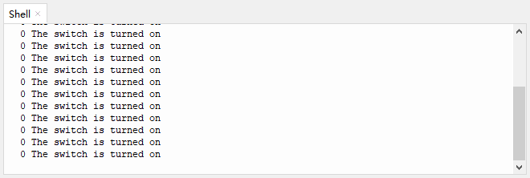
   
   A ：We add a space to separate the value and contents.
   
   
   
   


4. ```python
   if tile_value == 0:
       print("The switch is turned on")
   else:
       print("The switch is turned off")
   ```

   **if statement**

   `tile_value`  = 0 (return True): Shell prints *The switch is turned on* ;

   `tile_value` ≠ 0 (return False): Shell prints *The switch is turned off* .

   

   The process flow of if statement:

   

   Running Principle: pose a condition to determine the trend of next step. If the condition is true, execute the code under this condition. If false, exit the execution.

   In Python, any non-zero/non-empty object is true, and everything else except true and None is false.
   
   - any non-zero/non-empty object is True
   - number 0, empty object and None are False
   - outputs are only True or False.

   Basic composition of an **if statement**:
   
   ```python
   if condition_1:
       statement_block_1
   else:
       statement_block_2
   ```

   If "condition_1" is True, execute "statement_block_1".

   If "condition_1" is False, skip "statement_block_1" to run "statement_block_2".

   Basic composition of an **if elif statement**:
   
   ```python
   if condition_1:
       statement_block_1
   elif condition_2:
       statement_block_2
   else:
       statement_block_3
   ```

   If "condition_1" is True, execute "statement_block_1" .

   If "condition_1" is False, skip "statement_block_1" to determine "condition_2".

   If "condition_2" is True, execute "statement_block_2" .
   
   If "condition_2" is False, skip "statement_block_2" to run "statement_block_3".


5. `time.sleep(0.1)`

   Delay 0.1s to stabilize the output, otherwise the Shell will print results at a very fast speed.


#### Test Result


After uploading code, tilt the sensor to the pins to connect them, and the red LED will light up, and the Shell prints *The switch is turned on* ;

If you tilt it to the other end, the pins will disconnected, so the red LED will go off and *The switch is turned off*  shows on the Shell.


Click  or Ctrl+C to exit the execution.


---

### 3.3 PIR Motion Sensor


The human body temperature is generally constant at about 37°, and will emit infrared signals with a wavelength of about 10μm. Passive infrared probes just work by detecting the specific infrared waves emitted by human body.

These 10μm infrared waves are enhanced by the Fresnel filter and concentrated on the infrared sensing source to control the interference of the environment. The infrared sensing sources are usually pyroelectric elements, which can generate an alarm signal when the infrared radiation temperature of the human body changes. Otherwise, no signal will be output.


#### Parameters


Operating voltage: DC 3.3 ~ 5V 

Operating current: 3.6 mA

Maximum power: 0.018 W

View angle: Y = 90°, X = 110° (theoretical value)

Detection distance: ≤5m

Operating temperature: -10°C ~ +50°C

Control signal: digital signal

Dimensions: 48 x 24 x 18 mm (without housing)

Positioning holes: diameter of 4.8 mm

Interface: telephone socket


#### Principle


Modules with blue housing are digital ones, so we should connect to digital io pins of the mainboard (ports with blue).


In this experiment, we connect the module to port 3. According to the board ports view, the digital io pin at port 3 is io3.

When the sensor detects a **human motion** nearby, it outputs high. If no, it outputs low.


#### Wiring Diagram


#### Test Code

Open **3.3PIR.py** in **Files** and click .

```python
'''
 * Filename    : PIR
 * Thonny      : Thonny 4.1.4
 * Auther      : http//www.keyestudio.com
'''
from machine import Pin
import time

PIR = Pin(3, Pin.IN)
while True:
    PIR_value = PIR.value()
    print(PIR_value, end = " ")
    if PIR_value == 1:
        print("Some body is in this area!")
    else:
        print("No one!")
    time.sleep(0.1)
```

#### Explanations


The code structure is exactly the same as the previous project. 

Loop: Read the power level input by the sensor and print it on the Shell. If it is High, the monitor will show  *Some body is in this area!* ; If it is Low, print *No one!* 


#### Test Result


After uploading code, when the PIR motion sensor detects **a human motion**, it outputs high and the red LED goes off. The Shell prints *Some body is in this area!* ;


If the sensor detects nothing, it outputs low and red LED lights up. Shell displays *No one!* .


Put you palm above the sensor, and wave it. The sensor will detect the motion and then output high. When you stay still or move your hand away, the sensor detects nothing so then outputs low.


Click  or Ctrl+C to exit the execution.


---

### 3.4 8002b Power Amplifier


The 8002b power amplifier is mainly composed of an adjustable potentiometer, a speaker and an audio amplifier chip. This module can amplify the output of small audio signals and play them through its low-power speaker. It can also be used as an external amplifier to play music.


#### Parameters


Operating voltage: DC 3.3 ~ 5V 

Operating current: ≤350 mA

Maximum power: 1.5 W

Operating temperature: -10°C ~ +50°C

Input signal: digital signal

Dimensions: 48 x 24 x 18 mm (without housing)

Positioning holes: diameter of 4.8 mm

Interface: telephone socket


#### Principle


Music is an invisible art. It is a language that narrates emotions and thoughts. 

The foundation of music, as we all know, is note. We can compose a variety of melodies and rhythms with different notes. Of all the notes, the most basic are seven:


We can compose a variety of melodies and rhythms with these notes.

This module must be drive by square waves to emit sound. We can change the duty cycle of PWM to control square waves.

- The greater the duty cycle is, the lauder the sound will be.

And the tones vary from different frequency of PWM.

- The higher the frequency is, the higher the tone will be.


**What is PWM?**

PWM (Pulse width modulation) simulates the change of analog signal through digital signal.

Pulse width is the high level in a complete square wave cycle. So, pulse width modulation is to adjust the high level(of course, in other words, low level is also adjusted).


- **PWM frequency**: the number of times the signal going from high level to low level and back to high level in 1 second (one cycle), that is, how many cycles there are in a second.

  **Unit**: Hz

  **Expression**: 50Hz 100Hz

- **PWM cycle**

  $ T= \frac {1}{f}$      $ Cycle= \frac {1}{frequency}$

  If the frequency is 50Hz, the cycle will be 20ms, i.e., there are 50 PWM cycles in one second.

- **PWM duty cycle**: the ratio of high level time to the whole cycle time.

  - Unit: %(1% ~ 100%)
  - Cycle: The time of a pulse signal. The number of cycles in 1s equals the frequency.
  - Pulse width time: high level time.

  
  
  <center>The relationship between duty cycle and LED brightness<center>

  The longer the high level time is, the greater the duty cycle will be, and the brighter the LED will be.

  **The PWM frequency corresponding to notes**:
  
  


On the 8002b power amplifier module, a potentiometer is designed to adjust the sound volume. Rotate it clockwise to turn the volume up.


Modules with blue housing are digital ones, so we should connect to digital io pins of the mainboard (ports with blue).


In this experiment, we connect the module to port 4. According to the board ports view, the digital io pin at port 4 is io2.


#### Wiring Diagram


#### Test Code

Open **3.4Power amplifier.py** in **Files** and click .

```python
'''
 * Filename    : Power amplifier
 * Thonny      : Thonny 4.1.4
 * Auther      : http//www.keyestudio.com
'''
from machine import Pin, PWM
import time

trumpet = PWM(Pin(2))

'''
-----------------------------
| Pitch names |  Frequency  |
|---------------------------|
|      C      |     523     |
|      D      |     587     |
|      E      |     659     |
|      F      |     698     |
|      G      |     784     |
|      A      |     880     |
|      B      |     988     |
-----------------------------
'''
a = [523,587,659,698,784,880,988]

while True:
    #Tone when the duty cycle is 1000
    for i in a:
        trumpet.duty_u16(1000)
        trumpet.freq(i)
        time.sleep(0.2)
    #Tone when the duty cycle is 5000
    for i in a:
        trumpet.duty_u16(5000)
        trumpet.freq(i)
        time.sleep(0.2)
```

#### Explanations


1. `from machine import Pin, PWM`

   Import PWM function.
   
   
   
    **machine.PWM**
   
   `machine.PWM(pin)`：PWM object function, set the specified GPIO to re-initialize and set the mode of PWM output. 
   
   `PWM.freq(value)` : set the PWM output frequency. 
   
   ​	value: PWM output frequency. The value should conform to the PWM frequency calculation formula.
   
   `PWM.duty_u16(value)` : set duty cycle. Corresponding values will be automatically calculated.
   
   ​	value: Set duty cycle ratio within 0-65536.


2. `trumpet = PWM(Pin(2))` 

   Connect the power amplifier to pin io2, output PWM.


3. `a = [523,587,659,698,784,880,988]`

   In Python, [] includes a list, elements in which are separated by commas.
   
   Create a list **a** and put elements in [ ], including 523, 587, 659, 698,7 84, 880, 988, which are correspond to frequency of C, D, E, F, G, A, B.


4. ```python
   #Tone when the duty cycle is 1000
   for i in a:
   	trumpet.duty_u16(1000)
       trumpet.freq(i)
       time.sleep(0.2)
   ```

   **for loop**: play tones when the duty cycle is 1000, each tone is played for 0.2 seconds.

   

   In Python, a for loop is an traversal flow that can be used to process every element(string, list, tuple, dictionary, set) in sequence, or to execute a loop for a specified number of times. 

   Here is the syntax of a for loop:
   
   ```python
   for iterating_var in sequence:
      statements(s)
   ```

   The process flow of for loop:

   

   Process strings:
   
   ```python
   # define string name
   hopy = "reaipaobu"
   # for loop process string
   for x in hopy: 
          print(x)
   ```

   Results:
   
   ```
   r
   e
   a
   i
   p
   a
   o
   b
   u
   ```
   
   In for loop, characters in the string will be output separately, so it is also called traversal loop function.


5. ```python
   #Tone when the duty cycle is 5000
   for i in a:
       buzzer.duty_u16(5000)
       buzzer.freq(i)
       time.sleep(0.2)
   ```

   Similarly, this for loop play tones when the duty cycle is 5000, each tone is played for 0.2 seconds.


#### Test Result


After uploading code, the amplifier repeatedly plays tone C, D, E, F, G, A, B of when the duty cycle is 1000 and 5000. You can hear the sound is louder when duty cycle equals 5000.

Click  or Ctrl+C to exit the execution.


---

### 3.5 6812 RGB Module


RGB LED is imaged in the intersection of three primary colors (RGB): red, green and blue. Both white LED and RGB LED are able to emit white light. The former is presented directly in white, while the latter is mixed with red, green and blue.

**Trichromatic Theory**


Human eyes are sensitive to RGB colors. Most colors can be synthesized by RGB in different proportions. Therefore, the vast majority of monochromatic light can also be decomposed into RGB colors. This is the most basic principle of colorimetry --- trichromatic theory.

Red, green and blue lights are called additive primary colors because by the combination of these three primaries in different proportion, various colored lights will produce. Similarly, there are also subtractive ones. So we may add or/and subtract colors as needed. 

The three primary colors of the paint can not compose white, yet, with optical elements, those of light can do it, which is mixed by **three equal parts of R, G, B**.

6812 RGB module is an intelligent external controlled LED light source that integrates control circuit and light emitting circuit. Each LED is a pixel with a total of four pixels, and they can be controlled by only one pin.


#### Parameters


Voltage: DC 3.3 ~ 5V 

Current: 140 mA

Maximum power: 0.7 W

Operating temperature: -10°C ~ +50°C

Dimensions: 48 x 24 x 18 mm (without housing)

Positioning holes: diameter of 4.8 mm

Interface: telephone socket


#### Principle


The 6812 RGB module contains four pixels in series. In fact, no matter how many pixels, we can control any one of the lights to show any color through only one pin.

Modules with blue housing are digital ones, so we should connect to digital io pins of the mainboard (ports with blue).


In this experiment, we connect the module to port 9. According to the board ports view, the digital io pin at port 9 is digital port io14.


#### Wiring Diagram


#### Test Code

Open **3.5pixel.py** in **Files** and click .

```python
'''
 * Filename    : pixel
 * Thonny      : Thonny 4.1.4
 * Auther      : http//www.keyestudio.com
'''
#import Pin, neopiexl and time module
from machine import Pin
import neopixel
import time

#define pin
led = Pin(14, Pin.OUT)
#pixel number
pixels = neopixel.NeoPixel(led, 4) 
#brightness range: 0 - 255
brightness=5

colors=[[brightness,0,0],                    #red
        [0,brightness,0],                    #green
        [0,0,brightness],                    #blue
        [brightness,brightness,brightness],  #white
        [0,0,0]]                             #off

#nested if loop, repeatedly light up in red, green, white and go off.
while True:
    for i in range(0,5):
        for j in range(0,4):
            pixels[j] = colors[i]  #pixel color
            pixels.write()         #write in pixels
            time.sleep_ms(50)
        time.sleep_ms(500)
    time.sleep_ms(500)
```

#### Explanations


1. `from neopixel`

   import neopixel to call its functions.
   
   
   
     **neopixel.NeoPixel**
   
   ```python
   neopixel.NeoPixel(pin, n)
   ```
   
   pin : connected pin
   
   n : pixel numbers


2. `led = Pin(14, Pin.OUT)`: connect 6812RGB module to pin io14.

   `pixels = neopixel.NeoPixel(led, 4)`: set pixel numbers to 4

   `brightness=5`: define brightness to 5, range 0 ~ 255.


3. ```python
   colors=[[brightness,0,0],                    #red
           [0,brightness,0],                    #green
           [0,0,brightness],                    #blue
           [brightness,brightness,brightness],  #white
           [0,0,0]]                             #off
   ```

   *colors* is a list, elements(separated by commas) in which are [brightness,0,0], [0,brightness,0], [0,0,brightness], [brightness,brightness,brightness], [0,0,0], corresponding to red, green, blue, white and off. 


4. ```python
   for i in range(0,5):
       for j in range(0,4):
           pixels[j] = colors[i]
           pixels.write()
           time.sleep_ms(50)
       time.sleep_ms(500)
   time.sleep_ms(500)
   ```

   A **nested for loops** is adopted here to repeatedly light pixels up in red, green, white and go off.

   

   

   **range()**: creates an integer list, generally used in for loop.

   **Function syntax:**

   `range(start, stop[, step])`

   - start: the beginning of counting. By default, the initial value is 0. For instance, range(5) equals range(0,5)
   - stop: the ending of counting, while **stop is excluded**. For example, range(0,5) includes [0, 1, 2, 3, 4] without 5.
   - step: step is 1 by default. Again, range(0,5) can also be written as range(0,5,1)
   
   So, `for i in range ()` means to assign values in range to variable i in sequence. statements(s) in for loop will be executed when an assignment occurs.

   

   Outer for loop:  i = 0; 

   Then the first inner for loop: j = 0:

   `pixels[j] = colors[i]`: that is  `pixels[0]=colors[0]`
   
   `pixels[j]` :  j  is the pixel number, starting from 0(0 is the first pixel).
   
   `colors[i]` :  i  is the value in colors, starting from 0(0 is the first group of value, i.e., [brightness,0,0] ).
   
   `pixels[0]=colors[0]` : the first pixel lights up in white.
   
   Then execute  `pixels.write()` : write the pixel data, the content is lighting up the first pixel in white.
   
   <u>The first</u> delay  `time.sleep_ms(50)` sets the lighting time of the pixel. The first pixel lights up for 50ms in white, and then the code enters next loop. During next loop, the first pixel is still on. 
   
   
   
   The second inner loop: i = 0, j = 1
   
   `pixels[0]=colors[1]` : set the second pixel to light up in white.
   
   `time.sleep_ms(50)`  : delay lighting time for 50ms and enter next loop. During next loop, the second pixel is still on. 
   
   
   
   Similarly, execute the third inner loop: i = 0,  j = 2. The third pixel lights up for 50ms in white, and then the code enters next loop. During next loop, the third pixel is still on. 
   
   
   
   The forth inner loop: i = 0 ,  j = 3. The forth pixel lights up for 50ms in white and is always on.
   
   
   
   Till now, the inner loop ends. 
   
   Execute <u>the second</u> delay `time.sleep_ms(500)` : delay 500ms; Then back to outer loop.
   
   The second outer loop:  i = 1, again, four times of inner loop. Four pixels light up in green this time; and delay 500ms.
   
   
   
   The third outer loop: i = 2, four times of inner loop. Four pixels light up in blue this time; and delay 500ms.
   
   
   
   The fourth outer loop: i = 3, four times of inner loop. Four pixels light up in white this time; and delay 500ms.
   
   
   
   The fifth outer loop: i = 4, four times of inner loop. Four pixels go off in sequence; and delay 500ms.
   
   
   
   Till now, the nested for loop is finished, so <u>the third</u> delay  `time.sleep_ms(500)`  should be executed: delay 500ms. 
   
   The whole  `while True:`  code is finished.
   
   
   
   **The role of these three delay:**
   
   1. The first delay slows down the lighting intervals of pixels. You can clearly see they light up one by one after adding delay. 
   
      delay 50ms:
   
      

      no delay:
   
      
   
   2. The second delay slows down the color changing time of pixels.
   
   	Add a delay of 500ms to clearly observe the change:
   
   	
   
   	Without 500ms delay: they changes so fast.
   
   	
   
   3. The third delay controls the time of the whole loop. We add a delay of 500ms after each loop so that the execution will not immediately go on. 


#### Test Result


After uploading code, the four pixels repeatedly light up in red, green, white and go off, in sequence.


Click  or Ctrl+C to exit the execution.


---

###  3.6 Thin Film Pressure Sensor


This thin film sensor is an analog input module. The previous modules we learned are all digital ones, so what is the difference between these two types? 

The digital modules can only input/output high or low (3.3V or 0V), while the analog ones can output/input any voltage value read by ADC analog ports within the range of 0~5V.


The thin film sensor can be regarded as a resistance variable with pressure. When the thin film(circled in red) is pressed, the sensor converts the pressure into resistance and outputs it through the pin(squared in blue).


**Using Method:**

1. Place the pressure sensitive area of the sensor on a firm, flat surface when in use. Using or bending the sensor on a curved or shaped surface will lead to a "responsive" state even without pressure; In this state, the sensor will detect a false pressure value, so the output value is not accurate. 

	If you cannot find an appropriate surface, disassemble the sensor housing.

	First, find the **buckle** of the housing:

	

	Place one of your thumb above the **buckle** and pinch the module with another hand. Pull the buckle in the direction shown below:

	

	At the same time, take the module out of the housing in the following direction:

	

	As follows:

	

	Place the housing upside down and place the thin film on it.

	

2. After the sensor is stressed and maintained pressure, the output value will drift slightly over time, usually within 5%. Under normal conditions, it is best to lay the film flat without pressure on it.


#### Parameters


Operating voltage: DC 3.3 ~ 5V 

Current: 0.5 mA

Maximum power: 0.0025 W

Range: 0 ~ 5kg

Trigger conduction pressure: 500g

Operating temperature: -10°C ~ +50°C

Dimensions: 48 x 24 x 18 mm

Positioning holes: diameter of 4.8 mm

Interface: telephone socket


#### Principle


The thin film on the sensor detects the pressure value. It converts the detected pressure value into voltage. As the pressure increases, the resistance and the output voltage gradually decreases (3.3V ~ 0). This voltage value is a continuous analog value ranging from 3.3V ~ 0.

<span style="color: rgb(10, 10, 200);">The main board is not able to process analog signals directly, so we need to convert them into digital ones. Therefore, ADC(Analog to Digital Converter) is required.</span>


**What is ADC?**

ADC(Analog to Digital Converter) converts analog values to digital ones. The ADC acquisition is integrated in our board, so you can call it directly. 

**kidspico ADC Parameters**

1. Reference voltage: 3.3V

2. Resolution: 12bit

   A n-bit ADC means this ADC contains 2ⁿ scales. 

   12-bit ADC contains $2^{12}=4096$ scales, and it outputs totally 4096 digital values (including from 0～ 4095), each scale is $\frac{3.3}{4095}≈0.00081(V)$ 。

3. General ADC input voltage calculation:

   <font face="courier New" color="black" size=6>$Vin= \frac {AVDD_{ADC}}{2^{Resolution Bit}-1}*ReadData$</font> 

   $AVDD_{ADC}$: Reference voltage

4. ADC channel: 5 channels

   ADC0 - ADC3 are GPIO26 - 29, among which ADC0, ADC1, ADC2 are available to commonly measure the analog voltage, while ADC3 detects on-board VSYS voltage.

   Since ADC4 is built-in, it cannot be used at the pin. It measures on-board temperature sensor.	


Modules with red housing are analog ones, so we should connect to analog ports of the mainboard (ports with red).


In this experiment, we connect the module to port 6. According to the board ports view, the analog io pin at port 6 is io28.


#### Wiring Diagram


#### Test Code

Open **3.6Pressure.py** in **Files** and click .

```python
'''
 * Filename    : Pressure
 * Thonny      : Thonny 4.1.4
 * Auther      : http//www.keyestudio.com
'''
from machine import ADC  # import ADC module
import time

# configure ADC, range: 0-3.3V
# define pin io26,io27,io28,io29 to ADC channel 0,1,2,3
Pressure = ADC(28)  #Photores = ADC(2)

# read analog value every 0.1s, convert the value into voltage output
while True:
    Pressure_value = Pressure.read_u16()
    voltage = Pressure_value / 65535 * 3.3
    print('ADC Value:',Pressure_value,'   Voltage:',voltage,'V')
    time.sleep(0.1)
```

#### Explanations


1. `from machine import ADC`

   import ADC module.

   

   **machine.ADC function**

   - `machine.ADC(id)`	: build an ADC object and initialize the corresponding ADC channel.

     id: can be either GPIO(PIN) object (GPIO26 ~ 29) or ADC channel (0 ~ 3)

   - `ADC.read_u16() `	: read the corresponding ADC value and return.

     ATTENTION: <span style="color: rgb(10, 10, 200);">In MicroPython, the ADC is converted to 16-bit for calculation, that is, from 0 to 65535. This function does not directly return the value read by ADC, but the processed one, which ranges from 0 to 65535.</span>

     ADC voltage calculation: <font face="courier New" color="black" size=6>$ Vin= \frac {ReadData*3.3}{65535}$</font>


2. `Pressure = ADC(28)` 

   Define ADC2 to receive the analog value of the thin film sensor.

   ADC0 - ADC3 are GPIO 26 - 29, among which ADC0, ADC1, ADC2 are available.


3. `Pressure_value = Pressure.read_u16()`

   Read the ADC2 value of corresponding channel, and return the read value.
   
   `read()` reads digital inputs, while `read_u16()` reads analog inputs. `u16` indicates that the result received is not a binary (0 or 1), but an unsigned 16-bit integer (0 ~ 65535).


4. `voltage = Pressure_value / 65535 * 3.3`

   Convert analog values into actual voltage.


5. `voltage = Water_value * conversion_fator`

   Convert values into voltage value. The voltage value (unit: V) equals analog value multiply by the voltage value of a single scale.


6. `print('ADC Value:',Pressure_value,'   Voltage:',voltage,'V')`

   `print()`  prints multiple values with a line break.

   The contents to be printed should be enclosed in single quotation marks.

   

   And these contents must be separated with commas.

   


7. `time.sleep(0.1)`

   Add a delay of 0.1s to refresh the values every 0.1s.


#### Test Result


After uploading code, the sensor detects pressure.


Press the thin film by your finger. As the pressure increases, the output voltage gradually decreases.

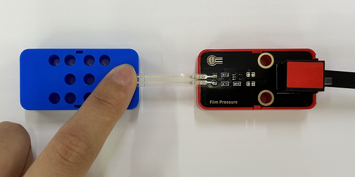


Click  or Ctrl+C to exit the execution.


---

### 3.7 HT16K33_8X8 Dot Matrix


Dot matrix is composed of multiple LEDs, whose collection is called the "matrix", where a single unit is called the "dot". The 8X8 dot matrix consists of a total of 64 LEDs, and each one is placed at the intersection of rows and columns.


#### Parameters


Operating voltage: DC 3.3 ~ 5V 

Current: 190 mA

Maximum power: 0.95 W

Operating temperature: -10°C ~ +50°C

Dimensions: 48 x 24 x 18 mm

Positioning holes: diameter of 4.8 mm

Interface: telephone socket


#### Principle


We control the white LED module by an IO port, so an 8x8 dot matrix requires a total of 16 ports, which is a very waste of ports. To this end, we specially designed this module, LEDs on which can be controlled by one I2C communication interface.

Modules with green housing are I2C ones, so we should connect to ports of the mainboard (ports with green).


In this experiment, we connect to port 5.


#### Wiring Diagram


#### Test Code

Open **3.7Dot matrix.py** in **Files** and click .

```python
'''
 * Filename    : Dot matrix
 * Thonny      : Thonny 4.1.4
 * Auther      : http//www.keyestudio.com
'''
from machine import Pin
import time
from HT16K33 import ht16k33

scl = Pin(5) 
sda = Pin(4)
bus = 0

LedArray1 = [0,0,0,0,0,0,0,0,   #heart
             0,1,1,0,0,1,1,0,
             1,0,0,1,1,0,0,1,
             1,0,0,0,0,0,0,1,
             0,1,0,0,0,0,1,0,
             0,0,1,0,0,1,0,0,
             0,0,0,1,1,0,0,0,
             0,0,0,0,0,0,0,0]

Triaxial = ht16k33(bus, scl, sda)
count = 0   #rotation direction
while True:
    Triaxial.setRotation(count)
    Triaxial.clear()
    for i in range(8):
        for j in range(8):
            Triaxial.drawPixel(i, j, LedArray1[i*8+j])
    Triaxial.writeDisplay()    
    count = count + 1
    time.sleep(1)
```

#### Explanations


**Conceive:**

1. Initialization. Configure I2C, set pins of scl and sda.

   Create an 8*8 array  `LedArray1`  to set an icon. In this array, 1 means LED on.  `LedArray1`  is a heart icon, as follows:
   
   
   
   Set an initial direction of 0 : `count = 0` . it is 0 by default.
   
2. Loop

   ①  `setRotation()`  sets rotation direction. There are four directions in total.
   
   ②  `clear()`  clears the display on the dot matrix.
   
   ③ Two for loop and  `drawPixel()` : write the values of  `LedArray1` .
   
   ```python
   for i in range(8):
   	for j in range(8):
       	Triaxial.drawPixel(i, j, LedArray1[i*8+j])
   ```
   
   ④  `writeDisplay()`  writes the values of  `LedArray1`  into the dot matrix and displays them.
   
   ⑤ `count = count + 1` : count adds 1 to change a rotation direction.
   
   ⑥ `time.sleep(1)`  delays 1s. The heart will show for 1s on each direction. 
   


#### Test Result


<span style="color: rgb(10, 10, 200);">Wire up first before uploading code. Or error may occur.</span>


<span style="color: rgb(10, 10, 200);">After the code is uploaded, if the module does not make a response, please press the reset button on the kidspico board.</span>


After uploading code, the dot matrix will show a heart in four directions with each maintaining for 1s. 


Click  or Ctrl+C to exit the execution.


---

### 3.8 RFID Module


RFID(Radio Frequency Identification) is a kind of communication that identifies specific targets through radio signals to read and write relevant data, without establishing mechanical or optical contact between the identification system and the specific target.

In application, RFID is widely used in clothing tags, library book searching systems, access control systems and food safety traceability systems.


#### Parameters


Operating voltage: DC 3.3 ~ 5V 

Operating current: 60 mA

Operating power: 0.3 W

Sensing range: 0 ~ 15 mm

Operating temperature: -10°C ~ +50°C

Dimensions: 48 x 24 x 18 mm (without housing)

Positioning holes: diameter of 4.8 mm

Interface: telephone socket


#### Principle


RFID adopts radio frequency to carry out non-contact two-way data transmission between the reader and the radio frequency card for target identification and data exchange. 

The working principle of RFID module:

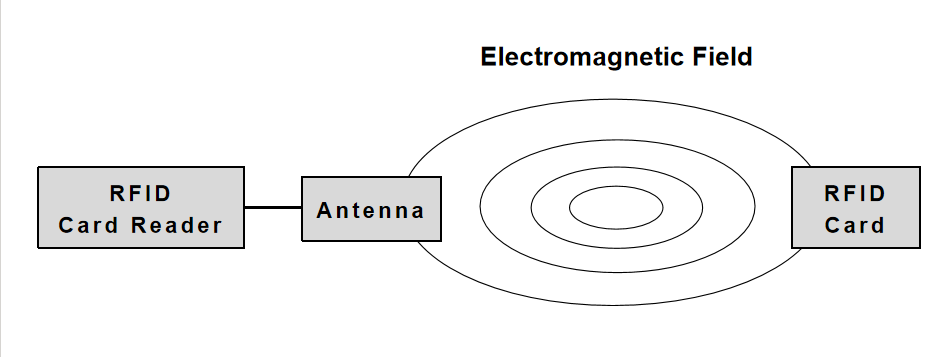

Sending signals: An RFID module (reader) sends a radio signal, usually an RF signal within a specific frequency range.

Reception response: When the IC card (RF card) enters the sensing range of the RFID module, the card receives signals from the reader and is activated by the energy obtained from them. After activation, the card's chip converts the stored information into a response signal that is sent back to the reader via the antenna.

Data processing: After the RFID module receives the signal sent by the IC card, it analyzes and processes these signals through the RF communication protocol. The board then receives these data and store, analyze, process, or pass it on to other systems.

Modules with green housing are I2C ones, so we should connect to ports of the mainboard (ports with green). In this experiment, we connect to port 7.


#### Wiring Diagram


#### Test Code

Open **3.8RFID.py**.

Upload library mfrc522_config.py, mfrc522_i2c.py and soft_iic.py to kidspico first, and click them to choose *Upload to /* .


Upload successfully. Click  to run the code.

```python
'''
 * Filename    : RFID
 * Thonny      : Thonny 4.1.4
 * Auther      : http//www.keyestudio.com
'''
import machine
import time
from mfrc522_i2c import mfrc522

# IIC configuration
addr = 0x28
scl = 5
sda = 4
    
rc522 = mfrc522(scl, sda, addr)
rc522.PCD_Init()  # Initialization
rc522.ShowReaderDetails()  # Display details of the PCD-MFRC522 card reader

while True:
    if rc522.PICC_IsNewCardPresent():  # Scan for a new card
        if rc522.PICC_ReadCardSerial() == True:  # New card is found
            print("Card UID:")
            print(rc522.uid.uidByte[0 : rc522.uid.size])  # Print detailed information
```

#### Explanations


**Conceive:**

1. Initialization. Configure IIC and initialize RFID module.

2. Loop.

   ① Keep sending signals to search new IC card(s).

   ② Receive IC card response and return the data.

   ③ Print the read details of the IC card.


#### Test Result


Before uploading code, please wire up accordingly to ensure that the Shell works normally. Or messy words may appear:


After uploading code, place the white IC card at the sensing range of the RFID module.


Shell will print the UID information of the IC card.


**NOTE: IC card data vary from cards. Please record your IC card information, which will be used in later experiment.**

Click  or Ctrl+C to exit the execution.


---

### 3.9 AK8975 Three-axis Magnetic Sensor


The three-axis magnetic sensor is used to measure and detect the magnetic field force. It detects geomagnetic field on three axes.

**Geomagnetic Field**

Geomagnetic field refers to the natural magnetic field that exists inside the Earth. The Earth can be regarded as a magnetic dipole, with one pole near the geographical North Pole and the other near the geographical South Pole. The force of this magnetic field is about 0.5 to 0.6 Gauss.


**Geomagnetic Sensor**

The geomagnetic field is a vector that, for a fixed location, can be divided into two components parallel to the local horizontal plane and one component perpendicular to the local horizontal plane. If the electronic compass is kept parallel to the horizontal plane, the three axes of the compass correspond to these three components.

For the two parallel components, their vector sum always points to magnetic north. **Course Angle (Azimuth)** in the compass is the Angle between the current direction and magnetic north. Since the compass remains horizontal, it is possible to calculate <span style="color: rgb(10, 10, 200);">**Course Angle**</span> through the values of the two axes(usually X and Y). When the compass rotates horizontally, **the Course Angle varies between 0° and 360°**.

To sum up, three-axis magnetic sensor is widely applied to navigation and positioning systems, attitude control and motion detection, environmental monitoring and safety applications, as well as medical devices. With continuous progress and innovation, its applications will expand, bringing more convenience and possibilities to all walks of life.


#### Parameters


Operating voltage: DC 3.3 ~ 5V 

Operating current: 20 mA (at self-check mode)

Maximum power: 0.1 W

Operating voltage: -10°C ~ +50°C

Dimensions: 48 x 24 x 18 mm (without housing)

Positioning holes: diameter of 4.8 mm

Interface: telephone socket


#### Principle


The three-axis magnetic sensor adopts IIC communication protocol. When using, we should connect to ports with green. In this experiment, we connect to port 8.


#### Wiring Diagram


#### Test Code

Open **3.9Three-axis magnetic sensor.py**.

Upload library AK8975C.py and click it to choose  *Upload to /* .


Upload successfully. Click  to run the code.

```python
'''
 * Filename    : Three-axis magnetic sensor
 * Thonny      : Thonny 4.1.4
 * Auther      : http//www.keyestudio.com
'''
from machine import Pin
from AK8975C import ak8975c
import time

scl = Pin(5) 
sda = Pin(4)
bus = 0
Triaxial = ak8975c(bus, scl, sda)

while True:
    Triaxial.measure()  # measure data once
    print('x:',Triaxial.X,'y:',Triaxial.Y,'z:',Triaxial.Z)  # print the geomagnetic force on axis X Y Z
    if Triaxial.AK8975_GET_AZIMUTH(Triaxial.X, Triaxial.Y) == True:  # Print the course angle value(azimuth value) only when the angle can be calculated.
        print('degree:', Triaxial.angle_val,'°')
```

#### Explanations


**Conceive:**

1. Initialization: configure IIC.

2. Loop:

   ① Measure the geomagnetic field on three axes.

   ② Print the measured values.

   ③ The Course Angle value (Azimuth) will not be printed until valid geomagnetic values are measured.


#### Test Result


Before uploading code, please wire up accordingly to ensure that the Shell works normally. 

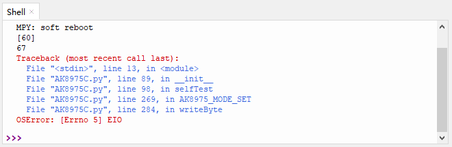

When you see the following messages, code is uploaded successfully.


Shell prints the values of axis X, Y, Z and the value of Course Angle.


Rotate the sensor horizontally, the Course Angle degree value will change in the range of 0° ~ 360°.


Click  or Ctrl+C to exit the execution.


---

### 3.10 Servo


There are many specifications of servos, yet all contains three wires: brown(GND), red(power positive) and orange(signal). Colors may vary from servo brands.

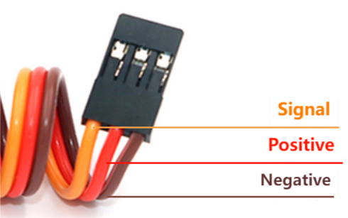


#### Parameters


Operating voltage: DC 3.3 ~ 5V

Rated voltage: 4.8V

Rated current: 200 mA

Angular speed: 60°/0.12s

Operating temperature: -10°C ~ +50°C

Length: 5 LEGO holes 8x5 = 40 mm

Width: 2 LEGO holes 8x2 = 16 mm

Height: 3 LEGO height units 3.2x3 = 9.6 mm

Basic hole size: diameter of 4.8mm

Interface: 3pin interface spacing 2.54 mm


#### Principle


Servo is usually controlled by PWM(pulse width modulation). This 270° servo is compatible with LEGO, whose angle ranges from -45°  ~ 225°.


NOTE: 270° servo rotates within -45° ~ 225°, which is 270° in total, rather than rotating to 270°.


**What is PWM?**

PWM (Pulse width modulation) simulates the change of analog signal through digital signal.

Pulse width is the high level in a complete square wave cycle. So, pulse width modulation is to adjust the high level(of course, in other words, low level is also adjusted).


- **PWM frequency**: the number of times the signal going from high level to low level and back to high level in 1 second (one cycle), that is, how many cycles there are in a second.

  **Unit**: Hz

  **Expression**: 50Hz 100Hz

- **PWM cycle**

  $ T= \frac {1}{f}$      $ Cycle= \frac {1}{frequency}$

  If the frequency is 50Hz, the cycle will be 20ms, i.e., there are 50 PWM cycles in one second.

- **PWM duty cycle**: the ratio of high level time to the whole cycle time.

  - Unit: %(1% ~ 100%)

  	

  - Cycle: The time of a pulse signal. The number of cycles in 1s equals the frequency.

  - Pulse width time: high level time

  	For instance, if cycle = 10ms, pulse width = 8ms: low power level duration = 2ms, and total duty cycle is $ \frac {8}{10} *100 %$ , unit:%.


#### Wiring Diagram

We connect the 270° servo to the pin io19 of the main board via 3pin wire spacing 2.54 mm.


#### Test Code

Open **3.10Servo.py** in **Files** and click .

```python
'''
 * Filename    : Servo
 * Thonny      : Thonny 4.1.4
 * Auther      : http//www.keyestudio.com
'''
from machine import Pin, PWM
import time

servo = PWM(Pin(19))
servo.freq(50)  #T = 1/f = 20ms

def angle(x):
    return int((((x + 45) * 1.8 / 270) + 0.6 )/ 20 *65535)

while True:   
    servo.duty_u16(angle(-45))
    time.sleep(1)
    servo.duty_u16(angle(0))
    time.sleep(1)
    servo.duty_u16(angle(90))
    time.sleep(1)
    servo.duty_u16(angle(180))
    time.sleep(1)
    servo.duty_u16(angle(225))
    time.sleep(1)
```

#### Explanations


1. `from machine import Pin, PWM`

   import PWM function.

   

    **machine.PWM**

   - `machine.PWM(pin)` : PWM object function, set the specified GPIO to re-initialize and set the mode of PWM output. 

     pin: is the GPIO object whose PWM output needs to be set.

   - `PWM.freq(value)` : set the PWM output frequency. 

     value: PWM output frequency. The value should conform to the PWM frequency calculation formula.

   - `PWM.duty_u16(value)` : set duty cycle. Corresponding values will be automatically calculated. Formula: `value/65536`.

     value: Set duty cycle ratio within 0-65535.

   - `PWM.duty_ns(value)` : set a high power level duration in the unit of ns.

     value: Set duty cycle ratio within 0-65535.


2. `servo = PWM(Pin(19))` 

   Connect servo to pin io19 to output PWM.


3. `servo.freq(50)`

   Set PWM output frequency to 50.
   
   Generally, a 20ms(0.02s) or so pulse is required to control the servo, so we can calculate: $ f= \frac {1}{T} =\frac {1}{0.02}=50$


4. ```python
   def angle(x):
       return int((((x + 45) * 1.8 / 270) + 0.6 )/ 20 *65535)
   ```
   
   Define a function angle to calculate the corresponding **value** in  `PWM.duty_u16(value)` . During using, set x to a needed angle, ranging from -45 ~ 225.
   


5. `servo.duty_u16(angle(-45))`

   angle() function sets PWM duty cycle. Here is the duty cycle of -45°.


#### Test Result


After uploading code, servo rotates from -45° to 0°, 90°, 180° and 225° accordingly with a pause of 1s after each rotation. And then it back to 0° to repeat these actions.

Click  or Ctrl+C to exit the execution.


---

## 4. Comprehensive Experiment

### 4.1 Card-scanning Door-lock Control Device

It is an ideal for smart safe house that the Card-scanning Door-lock Control Device features both security and convenience.

In this experiment, we adopt RFID module and a servo to form a door-lock control device, and the RFID module works in real time. When the correct IC card is identified, the door opens; Otherwise, the door won't open.

#### Flow


#### Assembly


**Required Parts**


**Step 1**


**Step 2**


**Step 3**


**Step 4**


**Step 5**

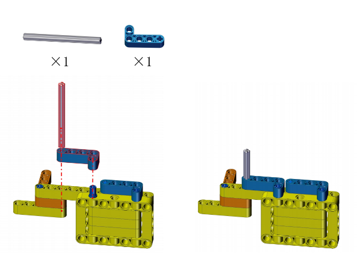


**Step 6**


**Step 7**


**Step 8**

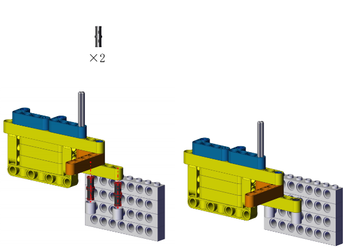


**Step 9**


**Step 10**


Calibration is required after the servo is mounted. Connect the servo to io19 on the board and connect the board to computer via USB cable.


Open **Servo_Calibration.py** in **Files** and click .

```python
'''
 * Filename    : Servo_Calibration
 * Thonny      : Thonny 4.1.4
 * Auther      : http//www.keyestudio.com
'''
from machine import Pin, PWM
import time

servo = PWM(Pin(19))
servo.freq(50)  #T = 1/f = 20ms

def angle(x):
    return int((((x + 45) * 1.8 / 270) + 0.6 )/ 20 *65535)

while True:   
    servo.duty_u16(angle(0))
```

After calibration, disconnect the board to the computer and continue the assembly.


**Step 11**


**Step 12**

<span style="color: rgb(10, 10, 200);">Note that the two gears mesh in order to drive smoothly.</span>


**Step 13**


**Step 14**


**Completed**

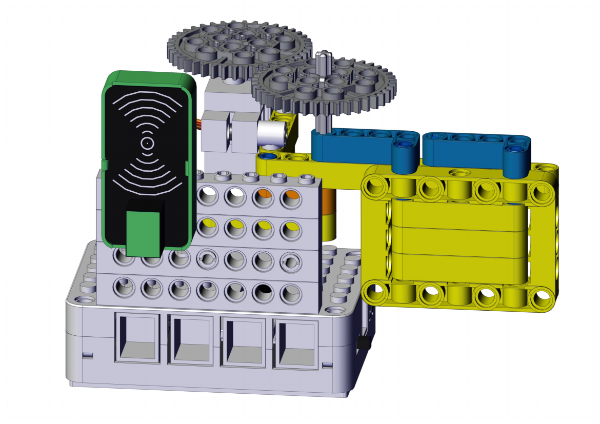


#### Wiring Diagram


#### Test Code

Open **4.1Card-scanning access control machine.py** in **Files** and click .

```python
'''
 * Filename    : Smart Safe Home: Card-scanning access control machine
 * Thonny      : Thonny 4.1.4
 * Auther      : http//www.keyestudio.com
'''
from machine import Pin, PWM
from mfrc522_i2c import mfrc522
import time

servo = PWM(Pin(19))
servo.freq(50)  #T = 1/f = 20ms

# IIC configuration
addr = 0x28
scl = 5
sda = 4    
rc522 = mfrc522(scl, sda, addr)
rc522.PCD_Init()  # Initialization
rc522.ShowReaderDetails()  # Display details of the PCD-MFRC522 card reader

UID =[244, 160, 150, 219] # UID code of the IC card, modify it to yours.

def angle(x):
    return int((((x + 45) * 1.8 / 270) + 0.6 )/ 20 *65535)

servo.duty_u16(angle(0))  # Initalize servo

while True:
    if rc522.PICC_IsNewCardPresent():  # Scan for a new card
        if rc522.PICC_ReadCardSerial() == True:  # New card is found
            if rc522.uid.uidByte[0 : rc522.uid.size] == UID:
                servo.duty_u16(angle(120))  # open the door
                time.sleep(3)
                servo.duty_u16(angle(0))    # close the door
            else:
                servo.duty_u16(angle(0))    # close the door
```

#### Explanations


**Conceive:**	

First, set the rotation angles for opening and closing the door. Herein, we set angle to 120° to open the door, and 0° to close the door.

Then, when the RFID module receives a correct IC card code, it drives the servo to open the door for 3s. Otherwise, servo stays still.


**Code structure:**

1. Initialization.

   On the basis of Chapter 3.8 and 3.10, we add an initialization code  `servo.duty_u16(angle(0))` for servo to ensure the door is closed before running code.

   Define UID code. The code of each card is unique, so please <span style="color: rgb(10, 10, 200);">replace the UID in code with yours.</span>

2. Loop.

   Determine whether the UID is correct. If yes, servo opens the door. If not, close the door. 
   


#### Test Result


After uploading code, scan the correct IC card, and the door will open for 3s and then close.


#### FAQ


**Q: No response after uploading code?**

A: Please check whether the IC card value is yours.

**Q: After the sensor detects the card, the servo rotates yet the door does not open?**

A: Power off immediately! Reassemble the building blocks according to the tutorial, noting that the servo needs to be calibrated before installation. Re-power on after the assembly is completed.


---

### 4.2 Invasion Alarm

Invasion alarm is a device that alarms when detecting illegal invasion in a prevention area. It plays a pivotal role in security prevention, so it is widely applied to family, stores, warehouses and supermarkets. Thus, our life can be better protected from illegal invasion. Meanwhile, our personal and property safety can also be guaranteed.

In this experiment, we adopt PIR motion sensor, power amplifier and a white LED to form an invasion alarm. When someone is detected, the white LED flashes and the amplifier alarms.

#### Flow


#### Assembly


**Required Parts**


**Step 1**


**Step 2**


**Step 3**


**Step 4**


**Step 5**

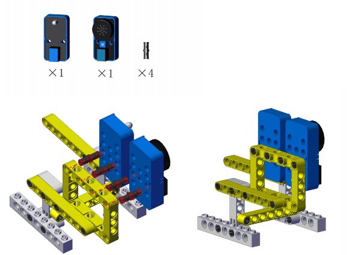


**Step 6**


**Step 7**


**Completed**


#### Wiring Diagram


#### Test Code

Open **4.2Invasion alarm.py** in **Files** and click .

```python
'''
 * Filename    : Smart Safe Home: Invasion Alarm
 * Thonny      : Thonny 4.1.4
 * Auther      : http//www.keyestudio.com
'''
from machine import Pin, PWM
import time

PIR = Pin(3, Pin.IN)
led = Pin(11, Pin.OUT)
trumpet = PWM(Pin(2))

while True:
    PIR_value = PIR.value()
    if PIR_value == 1:
        for i in range(6):
            trumpet.freq(880)
            trumpet.duty_u16(2000)
            led.on()
            time.sleep(0.5)
            trumpet.freq(523)
            trumpet.duty_u16(1000)
            led.off()
            time.sleep(0.5)
    else:
        trumpet.duty_u16(0)
        led.off()
```

#### Explanations


**Conceive:**

When the sensor detects a human motion (an invasion), the LED flashes and the amplifier alarms. If it detects nothing, LED will go off and the amplifier will not emit sound.


**Code structure:**

1. Initialization.

	Set the pins of the PIR motion sensor, white LED module and the power amplifier.

2. Loop.

   Read the power level of the board input from the PIR motion sensor.

   Determine whether the power level is 1(indicates an invasion).

   - If yes, the LED flashes and the amplifier alarms.
   - If not, LED will go off and the amplifier will not emit sound.


#### Test Result


After uploading code, when the sensor detects a human motion (an invasion), the LED flashes and the amplifier alarms.


#### FAQ


**Q: After uploading code, the LED and amplifier are no response when you put your palm in front of the sensor?**

A: The PIR motion sensor detects only **movement** rather than objects.

**Q: After uploading code, the LED lights up but the amplifier does not emit sound?**

A: Rotate clockwise the potentiometer on the amplifier to turn up the sound volume.


---

### 4.3 Track Alarm

Track alarm ensures security by detecting pressure. It will remind host when detecting tracks to ensure the safety and property.

In this experiment, we adopt a 8x8 dot matrix and a thin film pressure sensor to form a track alarm. When someone is detected stepping on the sensing area, the dot matrix displays a footprint pattern as a reminder.

#### Flow


#### Assembly


**Required Parts**

<span style="color: rgb(10, 10, 200);">Place the pressure sensitive area of the sensor on a firm, flat surface when in use. For details, please refer to Chapter 3.6.</span>


**Step 1**


**Step 2**


**Step 3**


**Step 4**


**Step 5**


**Step 6**


**Step 7**


**Step 8**


**Step 9**


**Completed**


#### Wiring Diagram


#### Test Code

Open **4.3Track alarm.py** in **Files** and click .

```python
'''
 * Filename    : Smart Safe Home: Track Alarm
 * Thonny      : Thonny 4.1.4
 * Auther      : http//www.keyestudio.com
'''
from machine import Pin,ADC
import time
from HT16K33 import ht16k33

Pressure = ADC(28)  # thin film pressure sensor

scl = Pin(5) 
sda = Pin(4)
bus = 0

LedArray1 = [0,0,0,1,1,0,0,0,   # footprint
             1,1,0,1,1,0,1,1,
             1,1,0,0,0,0,1,1,
             0,0,0,1,1,0,0,0,
             0,0,1,1,1,1,0,0,
             0,1,1,1,1,1,1,0,
             0,1,1,1,1,1,1,0,
             0,0,1,1,1,1,0,0]

Triaxial = ht16k33(bus, scl, sda)

while True:
    Pressure_value = Pressure.read_u16()
    if Pressure_value < 40000:
        Triaxial.setRotation(0)  # rotation direction
        Triaxial.clear()
        for i in range(8):
            for j in range(8):
                Triaxial.drawPixel(i, j, LedArray1[i*8+j])
        Triaxial.writeDisplay()    
        time.sleep(1)
    else:
        Triaxial.clear()
        Triaxial.writeDisplay() 
```

#### Explanations


**Conceive:**

When someone steps on the pressure sensing area of the sensor, the output analog value of the sensor will decrease. 

Set a threshold first to determine whether there is pressure. When the output value is smaller than the threshold, someone steps on this area; If the value is greater than the threshold, no track is detected.

If pressure is detected, a footprint icon will be displayed on the dot matrix. 


**Code structure:**

1. Initialization.

   Configure I2C, set scl and sda pins, set the pin of the thin film pressure sensor.

   Create an 8*8 array  `LedArray1`  to set the footprint icon.

2. Loop.

   Determine whether the output analog value is smaller than 40000 (if yes, tracks are detected).

   - analog value < 40000: the dot matrix shows a footprint icon as a reminder.
   - analog value ≥ 40000: the dot matrix displays nothing.


#### Test Result


After uploading code, press the thin film with your finger, and you will see the dot matrix shows a footprint.


#### FAQ


**Q: After uploading the code, nothing shows on the matrix when the thin film is pressed?**

A: ① The pressure value may be not reach the threshold, so please set a smaller one. ② Try again after pressing the reset button.


---

### 4.4 Motion Alarm

Motion alarm has become an important anti-theft device to protect the items in the smart safe house.

In this experiment, we adopts a three-axis magnetic sensor, a power amplifier and a 6812 RGB module to form a motion alarm. When a certain item moves to a specific angle, the alarm will be triggered: the amplifier sounds and the 6812 RGB emits lights.

#### Flow


#### Assembly


**Required Parts**


**Step 1**


**Step 2**


**Step 3**


**Step 4**


**Step 5**


**Step 6**


**Step 7**


**Completed**


#### Wiring Diagram


#### Test Code

Open **4.4Motion Alarm.py** in **Files** and click .

```python
'''
 * Filename    : Smart Safe Home: Motion Alarm
 * Thonny      : Thonny 4.1.4
 * Auther      : http//www.keyestudio.com
'''
from machine import Pin, PWM
from AK8975C import ak8975c
import neopixel
import time

trumpet = PWM(Pin(2))  # power amplifier

scl = Pin(5) 
sda = Pin(4)
bus = 0
Triaxial = ak8975c(bus, scl, sda)

led = Pin(14, Pin.OUT)  # 6812RGB module
pixels = neopixel.NeoPixel(led, 4) 
brightness=5

while True:
    Triaxial.measure()  # measure data once
    print('x:',Triaxial.X,'y:',Triaxial.Y,'z:',Triaxial.Z)  # print the geomagnetic force on axis X Y Z
    if Triaxial.AK8975_GET_AZIMUTH(Triaxial.X, Triaxial.Y) == True:  # Print the course angle value(azimuth value) only when the angle can be calculated.
        degree = Triaxial.angle_val
        print('degree:', degree,'°')

        if degree > 0.0 and degree < 45.0:
            trumpet.duty_u16(0)
            for i in range(4):
                pixels[i] = (0,0,0)
                pixels.write()            
        else:
            for i in range(4):
                pixels[i] = (255,255,0)
                pixels.write()
            trumpet.freq(880)
            trumpet.duty_u16(2000)
            time.sleep(0.3)
```

#### Explanations


**Conceive:**

Set a threshold angle range to determine whether objects have been moved.

Place the object and ensure its Course Angle is within the range, which means the object is not moved. Once the Course Angle value is greater than the threshold, it indicates that the item has been moved, so the amplifier alarms and the 6812 RGB lights up.


**Code structure:**

1. Initialization. Set the pins of the power amplifier, 6812 RGB module and IIC interface.

2. Loop.

   Print the calculated Course Angle.

   Determine whether the angle is within 0° ~ 45°(this range can be modified according to needs).

   - 0° < angle < 45°: the amplifier stay quiet and LED keeps off.
   - angle is not within 0° ~ 45°: the object is moved, so the amplifier alarms and the LED lights up in yellow. 


#### Test Result


After uploading code, place the device and maintain the Course Angle within 0° ~ 45°. In the initial state, the amplifier does not emit sound and the pixels are off. Move this device, and the angle will exceed the range of 0° ~ 45°, so the amplifier alarms and the pixels are on in yellow.


#### FAQ


**Q: After uploading the code, the amplifier alarms no matter how we move the device?**

A: You may scale up the standard range according to needs.


---
