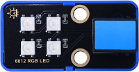
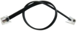
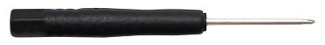
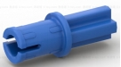
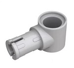
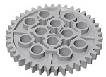

# Smart Safe House Kit

## Description

Based on KidsBlock and python programming language, the Smart Safe House Kit is designed for children aged 9-12 years old, which can be adapted to Legos and three types of mainboards: kidsUNO, kidsIOT and kidspico.

KidsBlock integrates building blocks to program by combining code blocks, so you do not have to learn complex programming syntax. You may learn programming much easier!

Python programming language is with simplicity and concise syntax, so it is easy to learn and suitable for beginners. You may master a systematic programming knowledge step by step!

In this kit, multiple sensors and modules are included: white LED module, 6812 RGB module, HT16K33_8X8 dot matrix, tilt sensor, 8002b power amplifier, thin film pressure sensor, PIR motion sensor, RFID module, AK8975 3-axis magnetic sensor, and 270° servo. Besides, we design four comprehensive experiments for the kit with building blocks: Card-scanning Door-lock Control Device, Invasion Alarm, Track Alarm, and Motion Alarm. These building blocks are provided, so you may design forms at will, which greatly improves logical analysis, creativity, hands-on skills and problem-solving ability.

---

## Kit List

**KD3025: Mainboards are NOT included in this kit.**

**KD3025-U kit includes kidsuno board.**

**KD3025-E kit includes kidsIOT board.**

**KD3025-P kit includes kidspico board.**

|  #   |             NAME              |                  PIC                  | QTY  |
| :--: | :---------------------------: | :-----------------------------------: | :--: |
|  1   |       White LED module        |            |  1   |
|  2   |        6812 RGB module        |            |  1   |
|  3   |    HT16K33_8X8 dot matrix     |            |  1   |
|  4   |          Tilt sensor          |            |  1   |
|  5   |     8002b power amplifier     |            |  1   |
|  6   |   Thin film pressure sensor   |            |  1   |
|  7   |       PIR motion sensor       |            |  1   |
|  8   |          RFID module          |            |  1   |
|  9   | AK8975 3-axis magnetic sensor |            |  1   |
|  10  |          270° servo           |        |  1   |
|  11  |        Telephone cable        |                |  5   |
|  12  |     Phillips screwdriver      |  |  1   |
|  13  |            IC card            |        |  1   |
|  14  |        Building block         |               |  18  |
|  15  |        Building block         |               |  1   |
|  16  |        Building block         |               |  5   |
|  17  |        Building block         |                  |  4   |
|  18  |        Building block         |                  |  2   |
|  19  |        Building block         |               |  2   |
|  20  |        Building block         |                  |  4   |
|  21  |        Building block         |               |  1   |
|  22  |        Building block         |               |  2   |
|  23  |        Building block         |                  |  1   |
|  24  |        Building block         |               |  5   |
|  25  |        Building block         |               |  1   |
|  26  |        Building block         |                  |  2   |
|  27  |        Building block         |                  |  1   |
|  28  |        Building block         |                  |  2   |
|  29  |        Building block         |               |  2   |
|  30  |        Building block         |               |  1   |

---

## Main Boards

**Before experiments, please have a good grasp of main boards:**

[kidsuno](https://wiki.kidsbits.cc/projects/KD2075/en/latest/)

[kidsIOT](https://wiki.kidsbits.cc/projects/KD2076/en/latest/)

[kidspico]( https://wiki.kidsbits.cc/projects/KD2077/en/latest/)

**On-board OLED Display Tutorials:**

[kidsuno_OLED](https://wiki.kidsbits.cc/projects/KD2075/en/latest/docs/kidsUno.html#oled-display)

[kidsIOT_OLED](https://wiki.kidsbits.cc/projects/KD2076/en/latest/docs/kidsIOT.html#id1)

[kidspico_OLED]( https://wiki.kidsbits.cc/projects/KD2077/en/latest/docs/KidsPico.html#id2)
